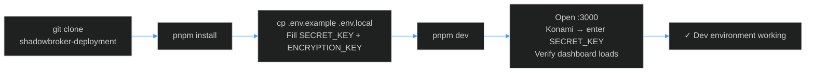
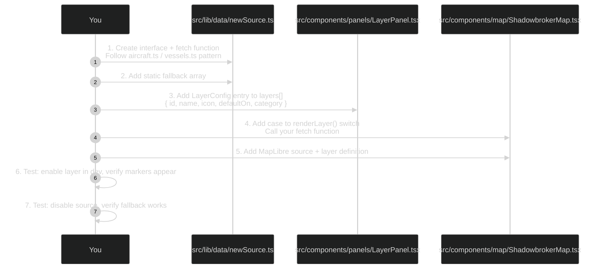
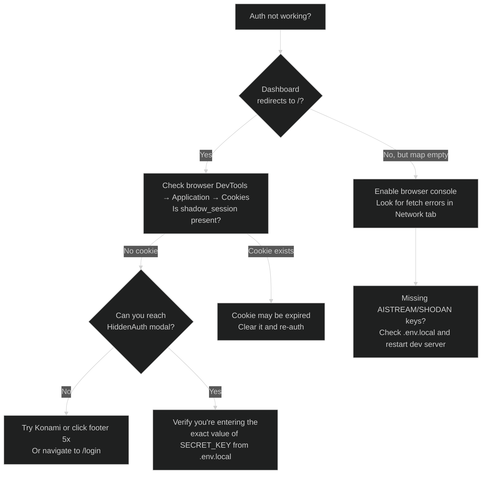

# Contributor Guide

Welcome to the BLACKTIVISM codebase. This guide covers everything you need to go from clone to your first merged PR.

---

## First-Day Setup



1. Clone the repo: `git clone git@github.com:AReid987/shadowbroker-deployment.git`
2. Install: `pnpm install`
3. Copy env: `cp .env.example .env.local` and set `SECRET_KEY` and `ENCRYPTION_KEY`
4. Start: `pnpm dev`
5. Verify: open `http://localhost:3000`, trigger Konami code, authenticate, confirm dashboard loads

See [Setup Guide](../01-getting-started/setup.md) for detailed env variable documentation.

---

## Repository Structure — Where Things Live

```
src/
├── app/
│   ├── page.tsx               ← Root route: renders DecoyLanding
│   ├── layout.tsx             ← Root layout: fonts, global CSS
│   ├── globals.css            ← OKLCH design tokens, glass-surface, fonts
│   ├── dashboard/
│   │   └── page.tsx           ← Tactical display: all dashboard logic
│   └── api/
│       ├── auth/
│       │   ├── validate/      ← POST: key → session cookie
│       │   └── session/       ← GET: validate existing session
│       └── proxy/
│           └── shodan/        ← GET: server-proxied Shodan queries
├── components/
│   ├── landing/
│   │   ├── DecoyLanding.tsx   ← Decoy page component (Konami + services)
│   │   └── CovertLogin.tsx    ← Trigger wrapper for HiddenAuth
│   ├── auth/
│   │   └── HiddenAuth.tsx     ← Auth modal (key input, rate limit UX)
│   ├── map/
│   │   └── ShadowbrokerMap.tsx ← 53KB map engine (MapLibre)
│   ├── panels/
│   │   ├── LayerPanel.tsx     ← Layer sidebar with health dots
│   │   ├── SearchBar.tsx      ← Geocoder search
│   │   ├── VisualModeSelector.tsx ← Mode switcher
│   │   ├── KeyboardShortcuts.tsx  ← Keyboard handler
│   │   ├── CctvViewer.tsx     ← Embedded camera panel
│   │   └── DossierPanel.tsx   ← Entity intel dossier
│   └── ui/
│       └── Toast.tsx          ← Toast notifications + useToasts hook
├── lib/
│   ├── auth.ts                ← validateKey, createSession, validateSession
│   ├── rateLimit.ts           ← Server-side in-memory rate limiter
│   ├── inviteCodes.ts         ← Ephemeral invite code management
│   ├── data/                  ← 21 data fetcher modules
│   │   ├── aircraft.ts        ← Military ADS-B
│   │   ├── vessels.ts         ← AIS vessel tracking
│   │   ├── cctv.ts            ← Camera feeds
│   │   └── ...18 more
│   └── utils/
│       ├── fetchWithRetry.ts  ← Retry + timeout wrapper
│       ├── dataCache.ts       ← localStorage TTL cache
│       ├── useDataHealth.ts   ← Layer health React hook
│       └── useSmartToast.ts   ← Context-aware toast hook
└── middleware.ts              ← Edge middleware: cookie guard
```

---

## First Task Walkthrough — Adding a New Data Layer

Adding a new intelligence layer is the most common contribution type. Here's the complete workflow:



**Step 1** — Create `src/lib/data/newSource.ts`:
```ts
import { fetchWithRetry } from '@/lib/utils/fetchWithRetry'
import { getCache, setCache } from '@/lib/utils/dataCache'

export interface NewEntity {
  id: string
  lat: number
  lng: number
  // ...entity-specific fields
}

export async function fetchNewEntities(): Promise<NewEntity[]> {
  try {
    const res = await fetchWithRetry('https://api.example.com/endpoint', {
      cache: 'no-store', retries: 2, timeout: 8000
    })
    const data = await res.json()
    const result = data.items.map(/* transform */).filter(e => e.lat && e.lng)
    setCache('new_entities', result)
    return result
  } catch (err) {
    console.error('Failed to fetch new entities:', err)
    return getCache<NewEntity[]>('new_entities') || STATIC_FALLBACK
  }
}

const STATIC_FALLBACK: NewEntity[] = [/* realistic sample data */]
```

**Step 2** — Add to `LayerPanel.tsx:38` layers array:
```ts
{ id: 'new_layer', name: 'New Source (42)', icon: <YourIcon />, defaultOn: false, category: 'CategoryName' }
```

**Step 3** — Add rendering to `ShadowbrokerMap.tsx` — follow the pattern of existing layers.

---

## Debugging Guide

### Authentication Issues



### Map Not Rendering

- `ShadowbrokerMap` uses `dynamic(() => import(...), { ssr: false })` — it will not render in Node.js
- If the map container is visible but blank, check for WebGL support in your browser
- Console error `MapLibre GL: WebGL not supported` → enable hardware acceleration

### Rate Limit Locally

```js
// Browser console — clear localStorage rate limit
localStorage.removeItem('auth_attempts')
```

### Checking Server-Side Errors

```bash
# Vercel deployment
vercel logs --follow

# Local: server-side errors appear in the terminal running pnpm dev
```

---

## Code Standards

| Area | Standard |
|------|---------|
| Language | TypeScript strict mode — no `any` (use `unknown` or proper types) |
| Style | Tailwind CSS — follow existing class patterns |
| Imports | Absolute paths via `@/` alias |
| Naming | camelCase for functions/vars, PascalCase for components/interfaces |
| Commits | Conventional Commits: `feat:`, `fix:`, `docs:`, `refactor:` |
| Error handling | Always handle errors — never swallow silently |
| API keys | Server-only unless absolutely necessary (`NEXT_PUBLIC_` prefix thoughtfully) |

---

## Workflow

```mermaid
%%{init: {'theme': 'dark', 'themeVariables': {'primaryColor': '#1e3a5f', 'primaryTextColor': '#e0e0e0', 'primaryBorderColor': '#4a9eed', 'lineColor': '#4a9eed'}}}%%
flowchart LR
    BRANCH["git checkout -b feat/my-feature"] --> CODE["Write code"]
    CODE --> LINT["pnpm lint<br>Fix all errors"]
    LINT --> BUILD["pnpm build<br>Zero TypeScript errors"]
    BUILD --> TEST["Manual test:<br>decoy → auth → dashboard → layers"]
    TEST --> PR["git push → Open PR<br>Describe: what, why, how to test"]
    PR --> REVIEW["Code review"]
    REVIEW --> MERGE["Merge → Auto-deploy to Vercel"]
```



**Never commit**:
- `.env` or `.env.local` files (they're in `.gitignore`)
- `node_modules/`
- `.next/` build output

<!-- Sources: src/app/dashboard/page.tsx:1, src/lib/auth.ts:1, src/lib/data/aircraft.ts:16, src/components/panels/LayerPanel.tsx:38, src/lib/utils/fetchWithRetry.ts:7 -->
