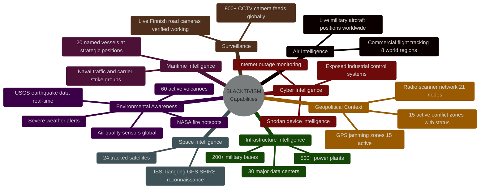
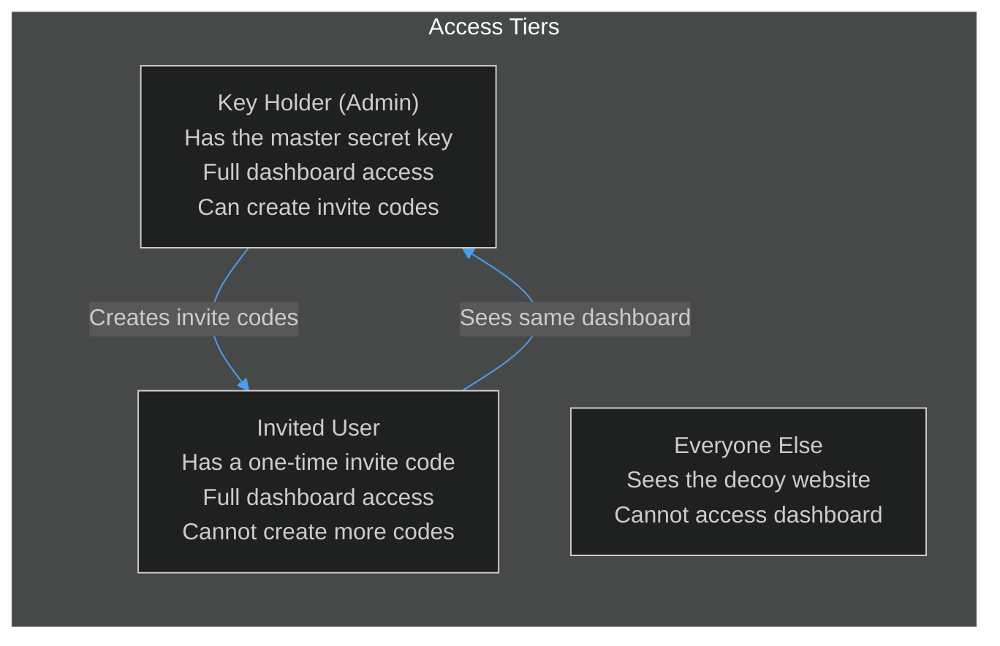
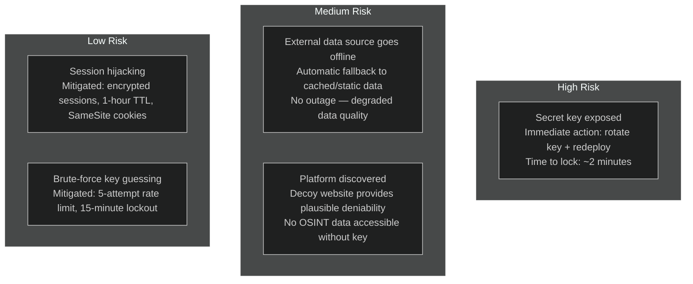

# Executive Briefing — BLACKTIVISM Platform

## What We Built

BLACKTIVISM is a real-time global intelligence monitoring platform — a private, web-based map that shows where significant things are happening in the world, right now.

It displays live positions of military aircraft, naval vessels, satellites, active conflict zones, earthquake activity, CCTV camera feeds, and more — all aggregated from publicly available data sources into a single, unified interface.

---

## Why It Exists

The core need was a private intelligence dashboard that could be operated with zero risk of casual discovery. The solution uses a two-layer architecture:

- **What the public sees**: A convincing, harmless-looking website (a fictional marketplace for absurdist business services)
- **What authorized users see**: A full global OSINT (Open Source Intelligence) tactical display

Access requires a secret key shared only with authorized individuals. No usernames, no accounts, no trails.

---

## Capability Map

---

## What We Did Not Build

This is important for realistic expectations:

- **No proprietary intelligence** — all data is public (OSINT). We aggregate; we do not produce
- **No historical data** — this is a live snapshot only; nothing is stored or searchable over time
- **No alerts or notifications** — the dashboard requires a human actively watching it
- **No user management** — access is binary: you have the key or you don't
- **No analytics** — we deliberately collect no user data

---

## Access Control Model

**Emergency lockout**: Replace the `SECRET_KEY` environment variable and redeploy. This immediately invalidates all sessions and invite codes. No one can access the dashboard until the new key is distributed.

---

## Operating Cost

| Component | Platform | Monthly Cost |
|-----------|----------|-------------|
| Frontend (website + dashboard) | Vercel | Free tier (hobby) |
| Optional backend API | Fly.io | ~$2.09/month |
| Domain (if custom) | Your registrar | ~$10-15/year |

The platform is designed to run at near-zero operating cost.

---

## Risk Register

---

## What "Open Source Intelligence" Means Here

Every data source is public. We do not hack, intercept, or access private systems. Examples:

- Aircraft positions: broadcast by the aircraft's own transponder (ADS-B)
- Vessel positions: broadcast by the ship's own AIS radio
- CCTV feeds: cameras on publicly accessible internet streams
- Earthquake data: published in real time by the US Geological Survey
- Satellite positions: calculated from publicly released orbital data

The intelligence value comes from aggregation and visualization, not from access to non-public data.

<!-- Sources: src/components/panels/LayerPanel.tsx:38, src/lib/auth.ts:1, DEPLOYMENT.md:32, README.md:1, ARCHITECTURE.md:1 -->
