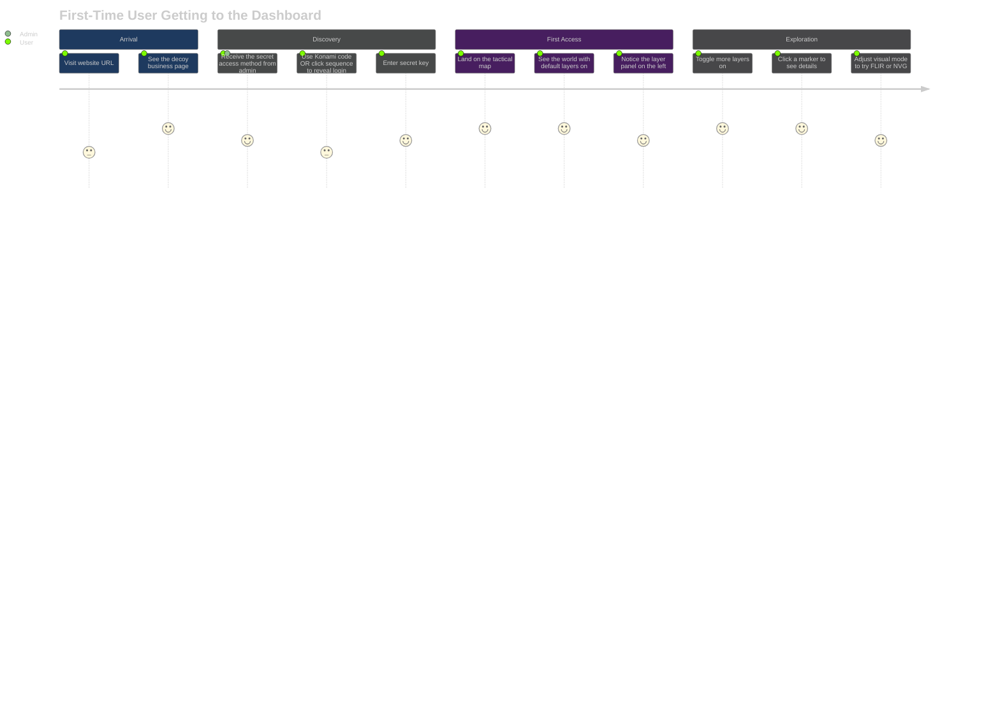
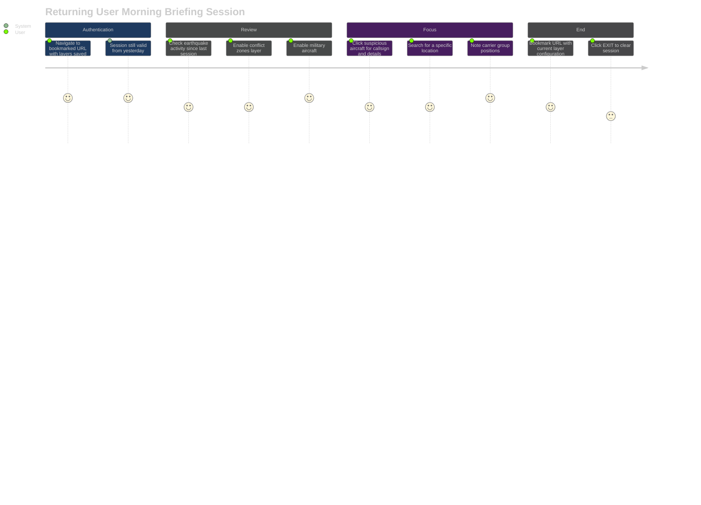
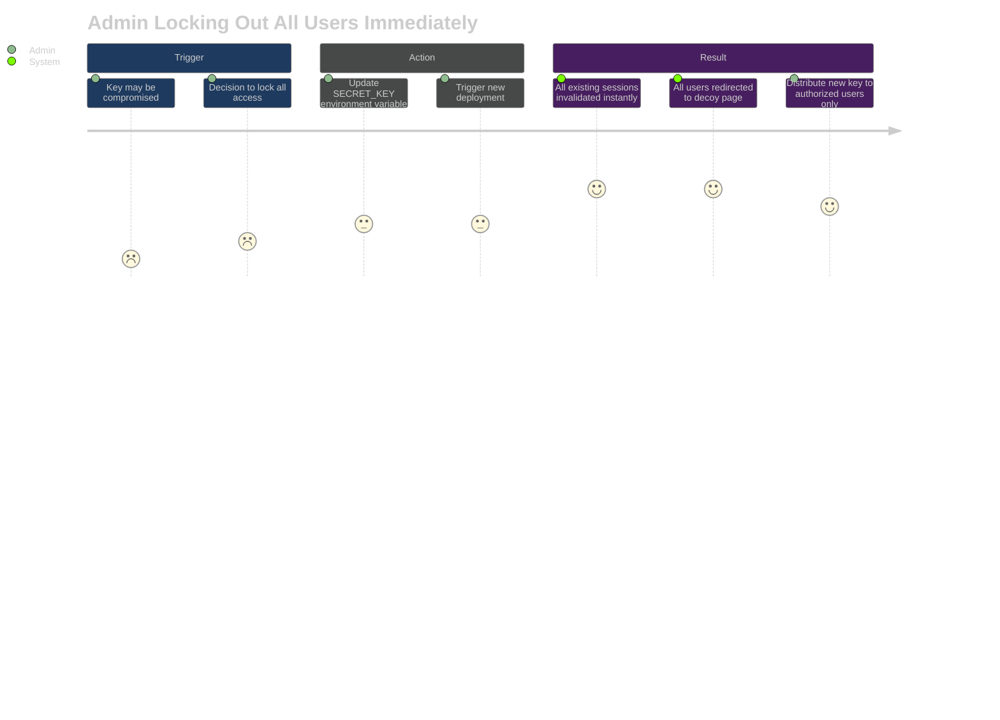
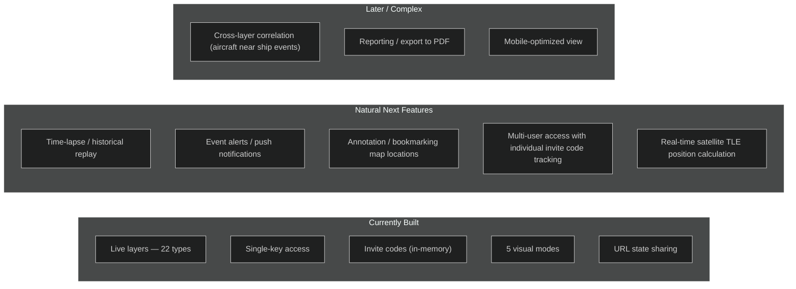

# Product Manager Guide — BLACKTIVISM

This guide explains what the product does, who uses it, how they use it, and what the known limitations are. No code.

---

## What Is This Product?

BLACKTIVISM is a private global situational awareness map. Think of it as a personal command-center screen that shows live activity happening around the world — aircraft in the sky, ships at sea, earthquakes, conflict zones, satellites, and more — all in one place, updated in real time.

It has a built-in cover story: the public website looks like a completely normal (if eccentric) commercial website. Only people who know the secret can get to the actual map.

---

## Who Uses It And Why

| User | Goal | Typical Session |
|------|------|----------------|
| OSINT researcher | Track military movements, cross-reference events | 30-90 minutes |
| Security professional | Monitor GPS jamming zones, internet outages | 15-30 minutes |
| Geopolitics analyst | Correlate conflict zones with naval positioning | 1-2 hours |
| Hobbyist | Explore live aircraft and ship traffic | 15-30 minutes |

---

## User Journeys

### Journey 1: First-Time Access

### Journey 2: Daily Situational Awareness Check

### Journey 3: Emergency Access Lock

---

## Feature List

### What It Shows (22 Intelligence Layers)

**Air**
- Live military aircraft worldwide (positions, callsigns, type, altitude, speed)
- Live commercial flights across 8 world regions

**Sea**
- Naval traffic including destroyers, carriers, submarines (20 vessels)
- Carrier strike group positions (20 groups)

**Ground / Rail**
- Major rail routes (19 tracked)

**Space**
- 24 tracked satellites — space stations, reconnaissance, GPS, communications

**Surveillance**
- 900+ CCTV camera feeds globally — click to view the live feed

**Signals**
- KiwiSDR radio scanner network (21 nodes)
- APRS mesh network nodes (26)
- GPS jamming zones (15 active)

**Environment**
- Earthquakes (USGS — real-time, M2.5+)
- Active volcanoes (60)
- NASA fire hotspots (16+)
- Severe weather alerts
- Air quality sensors

**Infrastructure**
- Military bases (200+)
- Power plants (500+)
- Data centers (30)
- Internet outages (15)

**Cyber**
- Shodan internet-exposed devices (webcams, industrial control systems)

**Context**
- Active conflict zones (15) with status
- Day/night terminator overlay

---

## Known Limitations

| Limitation | Impact | Workaround |
|-----------|--------|-----------|
| Data is live snapshots, not historical | Can't analyze trends over time | Manual note-taking |
| Aircraft positions from public ADS-B only | Some military aircraft transponders are off | Incomplete picture |
| AIS vessel data requires API key | Without key, shows 20 static vessels | Request API key setup |
| Satellite positions are approximate | Not GPS-accurate; illustrative positions | For general awareness only |
| CCTV feeds may go offline | Broken image or black frame | Try another camera |
| No alerting / notifications | Must actively watch for events | Manual monitoring |
| Sessions expire after 1 hour | Must re-authenticate | Bookmark URL with layers for quick return |
| Rate limited to 5 login attempts per 15 minutes | Locked out temporarily on too many wrong keys | Wait 15 minutes |

---

## The Cover Story — Why It Matters

The decoy page is not just cosmetic. It serves a specific purpose: if someone stumbles onto the URL, they see a completely normal-looking website and have no reason to investigate further. The actual intelligence platform is invisible without the secret access method.

This is called "security through obscurity" used as a supplementary layer (not the primary defense — the secret key is the primary defense).

The decoy currently presents as a marketplace for fictional services including feline tax preparation and other deliberately absurd offerings — convincing enough to dismiss, odd enough to not invite close scrutiny.

---

## Roadmap Gaps (Unbuilt Features)

Based on the current architecture, these are the most natural next capabilities:

<!-- Sources: src/components/panels/LayerPanel.tsx:38, src/components/landing/DecoyLanding.tsx:1, src/lib/auth.ts:110, src/app/dashboard/page.tsx:254, QUICK_REF.md:31 -->
