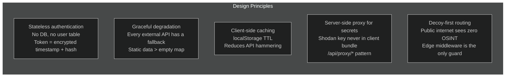
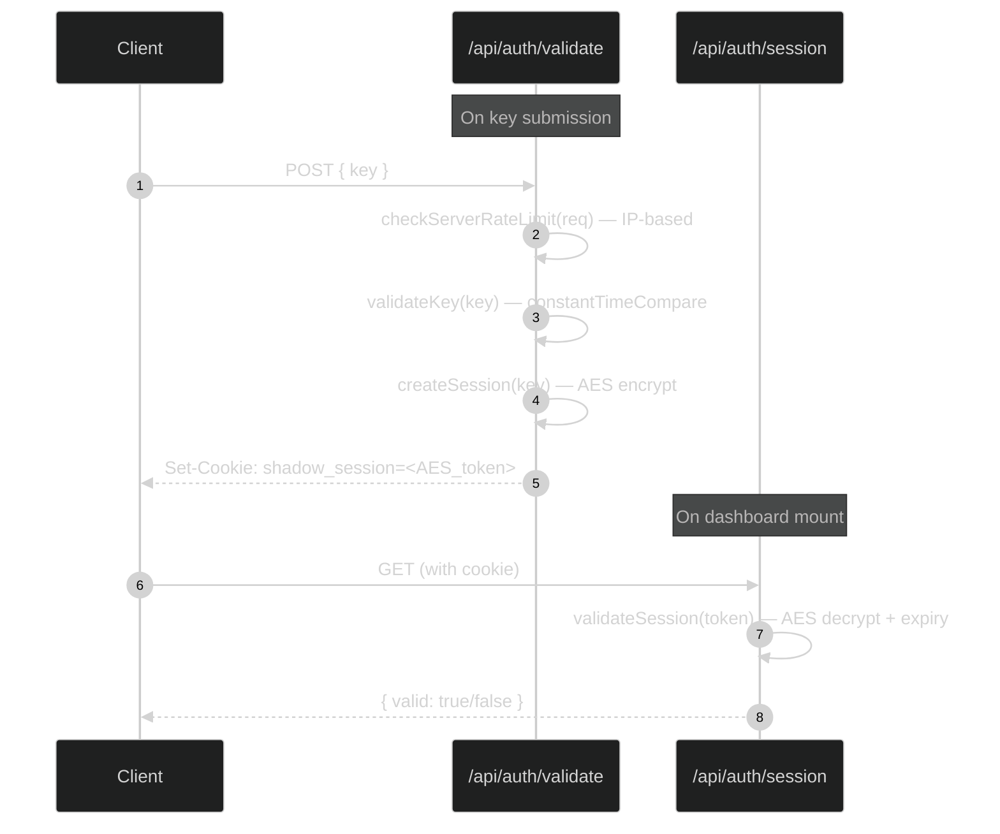
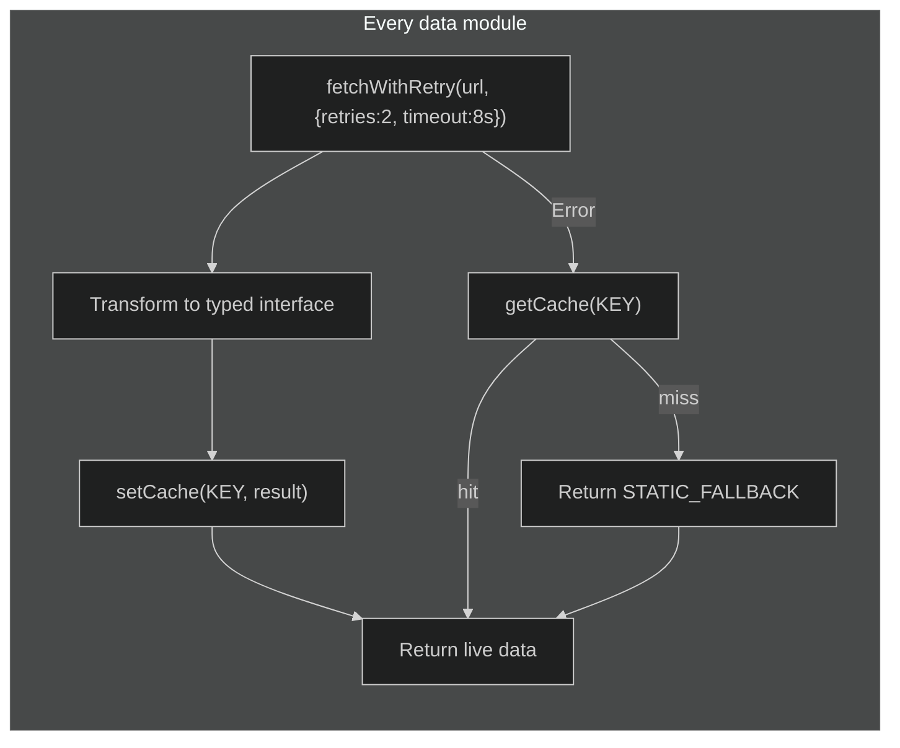
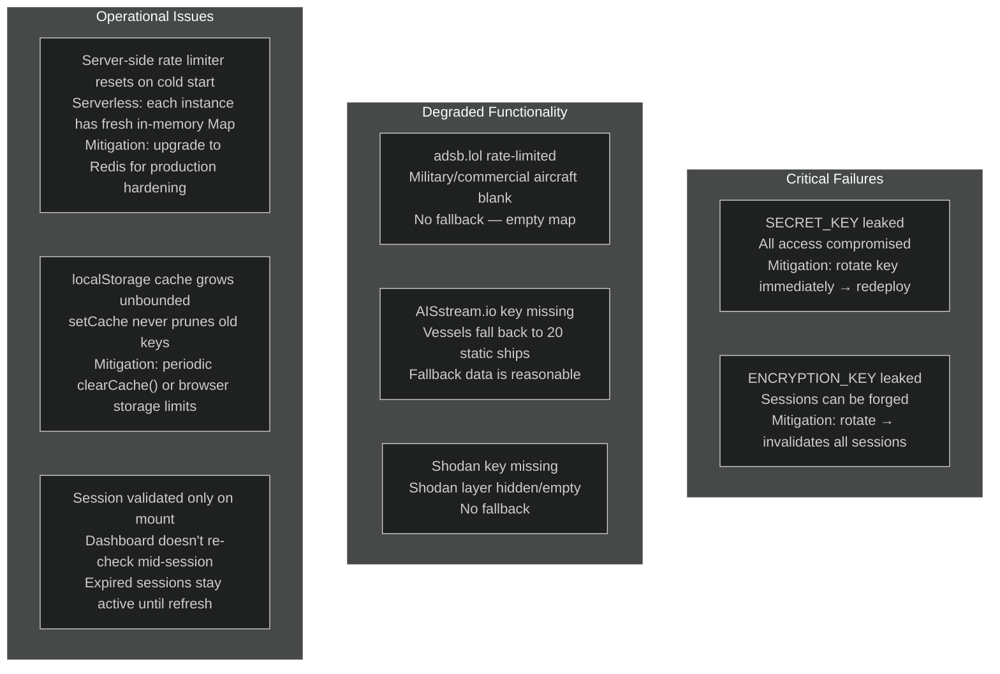

# Staff Engineer Onboarding

This document is for engineers operating at a systems-thinking level. It covers architectural philosophy, tradeoff space, failure modes, and where the bodies are buried.

---

## The One Core Insight

BLACKTIVISM is a **keyhole architecture**: a single shared deployment hosts two completely different user experiences, separated by a single HTTP cookie. The entire security posture rests on three primitives:

1. **Edge middleware runs before rendering** — unauthenticated requests never touch dashboard code
2. **AES encryption is the session store** — there is no database; the encryption key IS the auth state
3. **The decoy page shares zero bundle overlap with the dashboard** — Next.js code splitting ensures this

The implication: rotating `ENCRYPTION_KEY` immediately invalidates all sessions. Rotating `SECRET_KEY` locks all users out. This is a feature, not a bug — it's the "emergency stop" mechanism.

---

## System Philosophy

---

## Architecture Abstractions

### Layer 1: Edge (Vercel Middleware)

[`src/middleware.ts`](https://github.com/AReid987/shadowbroker-deployment/blob/main/src/middleware.ts#L4) runs on Vercel's edge network before any page renders. It performs a single check: does the request to `/dashboard` carry a `shadow_session` cookie? If not, redirect to `/`.

**What it doesn't do**: It does not decrypt or validate the token. It only checks presence. Token validity is verified in the `/api/auth/session` route after the page mounts.

**Implication**: A user with a stale (expired) cookie will initially reach the dashboard, but the `checkAuth` effect on mount ([`dashboard/page.tsx:94`](https://github.com/AReid987/shadowbroker-deployment/blob/main/src/app/dashboard/page.tsx#L94)) will detect the invalid session and redirect to `/`.

### Layer 2: API Route Authentication

### Layer 3: Data Fetching

The cache is `localStorage`. This is notable: there is no server-side caching layer. Each browser session independently caches data. Cache TTL is 5 minutes across all modules.

---

## Key Decisions & Tradeoffs

### Decision 1: AES Token — No Session DB

**Chosen**: AES-encrypted client cookie containing expiry  
**Rejected**: Redis/KV session store, JWT with server validation  

**Why**: Vercel Serverless functions are stateless and may run on different instances. A Redis dependency adds cost and operational complexity. The tradeoff is that sessions cannot be revoked individually — rotating `ENCRYPTION_KEY` revokes everyone at once.

### Decision 2: Client-Side Data Fetching

**Chosen**: Data fetchers run in the browser, data served from external APIs directly to client  
**Rejected**: Server-side data fetching, proxy-everything approach  

**Why**: OSINT data is public by definition. The only exception is Shodan (API key required), which uses the `/api/proxy/shodan` server-side proxy. Direct client fetching reduces Vercel function invocations and simplifies the data pipeline.

### Decision 3: Static Data Fallbacks

**Chosen**: 20-ship AIS fallback, 24 satellite positions, 200+ infrastructure entries as static TypeScript  
**Rejected**: Database, CMS, or dynamic loading of fallback data  

**Why**: The fallback data is geopolitically meaningful and curated. It serves as demo data when APIs are unavailable. The tradeoff is that `infrastructure.ts` (68KB) is a large static file.

### Decision 4: No User Accounts

**Chosen**: Single master `SECRET_KEY`, optional invite codes (in-memory, ephemeral)  
**Rejected**: User table, hashed passwords, OAuth  

**Why**: User data is a liability. The platform's security model is key-based: the key holder controls all access. Multiple users share the same key or receive time-limited invite codes.

---

## Failure Modes

---

## Where to Go Deep

For engineers wanting to understand specific subsystems:

| Topic | Start Here |
|-------|-----------|
| Auth internals | [`src/lib/auth.ts:34`](https://github.com/AReid987/shadowbroker-deployment/blob/main/src/lib/auth.ts#L34) — constantTimeCompare |
| Map rendering pipeline | [`src/components/map/ShadowbrokerMap.tsx:1`](https://github.com/AReid987/shadowbroker-deployment/blob/main/src/components/map/ShadowbrokerMap.tsx#L1) |
| Data fetcher pattern | [`src/lib/data/aircraft.ts:16`](https://github.com/AReid987/shadowbroker-deployment/blob/main/src/lib/data/aircraft.ts#L16) |
| Cache internals | [`src/lib/utils/dataCache.ts:1`](https://github.com/AReid987/shadowbroker-deployment/blob/main/src/lib/utils/dataCache.ts#L1) |
| Rate limiter | [`src/lib/rateLimit.ts:21`](https://github.com/AReid987/shadowbroker-deployment/blob/main/src/lib/rateLimit.ts#L21) |
| Decoy trigger mechanism | [`src/components/landing/DecoyLanding.tsx:8`](https://github.com/AReid987/shadowbroker-deployment/blob/main/src/components/landing/DecoyLanding.tsx#L8) |
| Invite codes | [`src/lib/inviteCodes.ts:1`](https://github.com/AReid987/shadowbroker-deployment/blob/main/src/lib/inviteCodes.ts#L1) |
| Security headers | [`next.config.js:18`](https://github.com/AReid987/shadowbroker-deployment/blob/main/next.config.js#L18) |

---

## Strategic Direction

The current architecture is deliberately minimal. Natural evolution paths:

1. **Persistent invite codes**: Move `inviteCodes.ts` from in-memory to Vercel KV or Upstash Redis to survive serverless cold starts
2. **Server-side rate limiting**: Same KV migration for `rateLimit.ts` — critical for multi-region deployments
3. **Live satellite tracking**: Replace static TLE-derived positions with real CelesTrak or N2YO API integration
4. **WebSocket AIS feed**: `vessels.ts` is designed for a WebSocket-first approach; the REST fallback is the current implementation
5. **Additional Shodan query types**: The `SHODAN_QUERIES` array is the only change needed to expose more device categories

<!-- Sources: src/middleware.ts:4, src/lib/auth.ts:34, src/app/dashboard/page.tsx:94, src/lib/rateLimit.ts:21, next.config.js:18 -->
