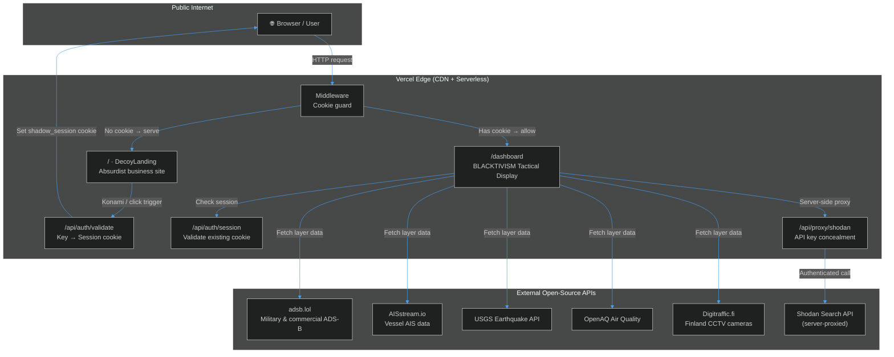
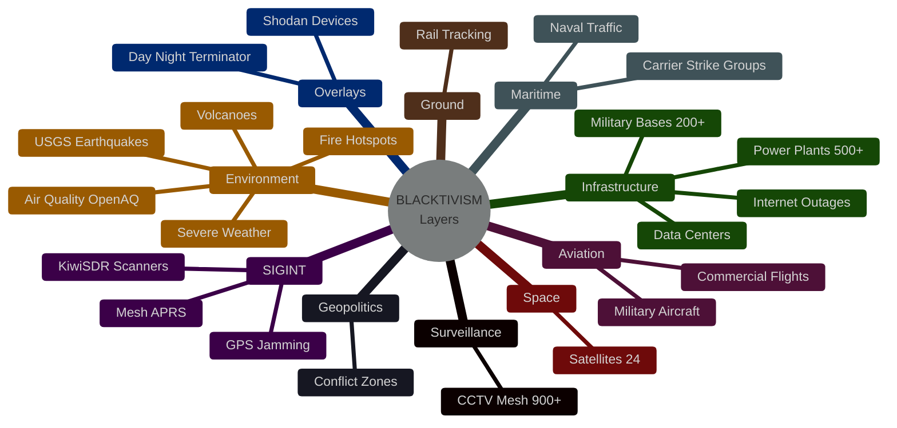
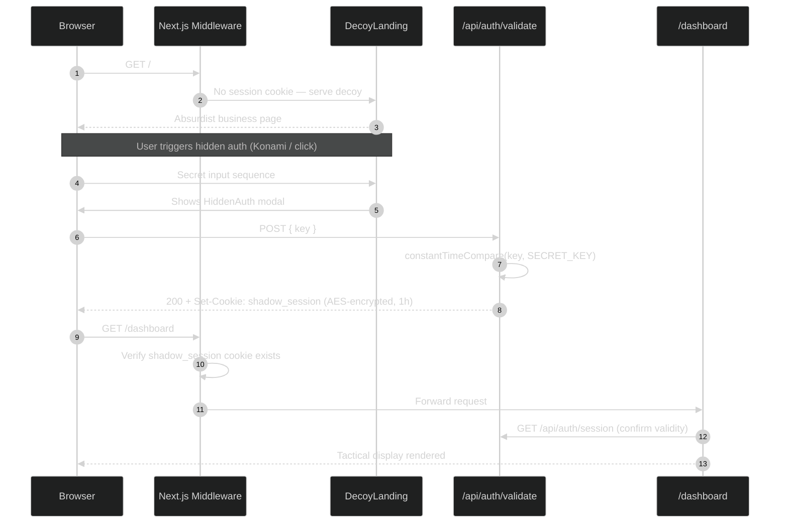
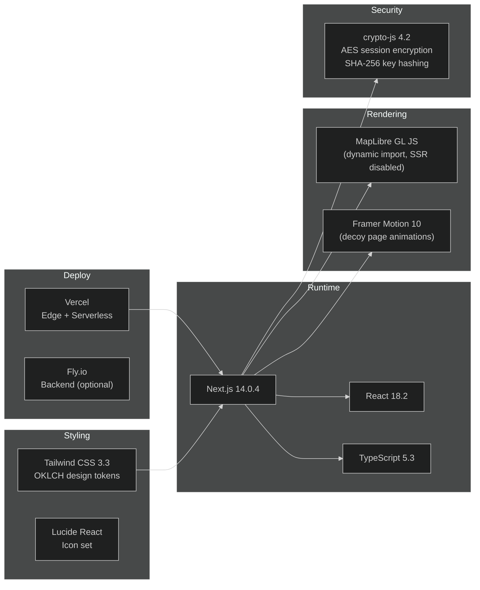

# BLACKTIVISM OSINT — Project Overview

> **Operational Security Notice**: This platform uses a dual-identity architecture. The public-facing website presents as a fictional commercial business. The actual OSINT intelligence dashboard is accessible only to holders of a valid secret key.

## What Is This?

**BLACKTIVISM** (internal codename: `shadowbroker-deployment`) is a covert geospatial intelligence platform built on Next.js 14. It aggregates real-time global telemetry from 21+ open-source data providers and renders them on an interactive MapLibre GL world map — wrapped in a decoy landing page that presents as a harmless, absurdist commercial website.

The system has exactly two user-visible states:

| State | URL | Who Sees It |
|-------|-----|-------------|
| Decoy ("Spreadsheet Enthusiasts" / absurdist services) | `/` | Everyone |
| OSINT Tactical Display | `/dashboard` | Session-cookie holders only |

---

## High-Level Architecture

---

## Intelligence Layer Taxonomy

The dashboard exposes **22 toggleable data layers** across 8 operational categories:

---

## Dual-Identity Security Model

---

## Technology Stack

---

## Key Directories

| Path | Purpose |
|------|---------|
| [`src/app/page.tsx`](https://github.com/AReid987/shadowbroker-deployment/blob/main/src/app/page.tsx#L1) | Root route — renders `DecoyLanding` |
| [`src/app/dashboard/page.tsx`](https://github.com/AReid987/shadowbroker-deployment/blob/main/src/app/dashboard/page.tsx#L1) | OSINT tactical display |
| [`src/app/api/auth/`](https://github.com/AReid987/shadowbroker-deployment/blob/main/src/app/api/auth) | Auth API routes (`validate`, `session`) |
| [`src/middleware.ts`](https://github.com/AReid987/shadowbroker-deployment/blob/main/src/middleware.ts#L4) | Edge middleware — cookie-based route guard |
| [`src/lib/auth.ts`](https://github.com/AReid987/shadowbroker-deployment/blob/main/src/lib/auth.ts#L1) | `validateKey`, `createSession`, `validateSession` |
| [`src/lib/data/`](https://github.com/AReid987/shadowbroker-deployment/blob/main/src/lib/data) | 21 geospatial data fetchers (aircraft, vessels, CCTV…) |
| [`src/components/map/ShadowbrokerMap.tsx`](https://github.com/AReid987/shadowbroker-deployment/blob/main/src/components/map/ShadowbrokerMap.tsx#L1) | 53 KB map engine (MapLibre, layer rendering) |
| [`src/components/landing/DecoyLanding.tsx`](https://github.com/AReid987/shadowbroker-deployment/blob/main/src/components/landing/DecoyLanding.tsx#L1) | Decoy page component |

---

## Design System: BLACKTIVISM Aigency Theme

The dashboard uses an OKLCH-based void color system and is styled as a spacecraft instrument panel:

- **Primary surface**: `oklch(0.10 0.015 250)` — deep void background  
- **Raised controls**: `oklch(0.17 0.015 250)`  
- **Accent**: `oklch(0.75 0.150 65)` — warm amber  
- **Typography**: JetBrains Mono (primary), VT323 / Share Tech Mono (display/TTY)  
- **Corners**: Sharp (0px border-radius) on all instrument surfaces  
- **Texture**: Bayer matrix dither overlay via `.glass-surface` CSS class  

See [`ARCHITECTURE.md`](https://github.com/AReid987/shadowbroker-deployment/blob/main/ARCHITECTURE.md#L22) for the full design token specification.

---

## Version

Current release: **BLACKTIVISM v0.4**  
Platform codename: **subterfuge-shadowbroker**  
Vercel team: `aigency0`

<!-- Sources: src/app/page.tsx:1, src/app/dashboard/page.tsx:1, src/middleware.ts:4, src/lib/auth.ts:1, src/components/panels/LayerPanel.tsx:38 -->
