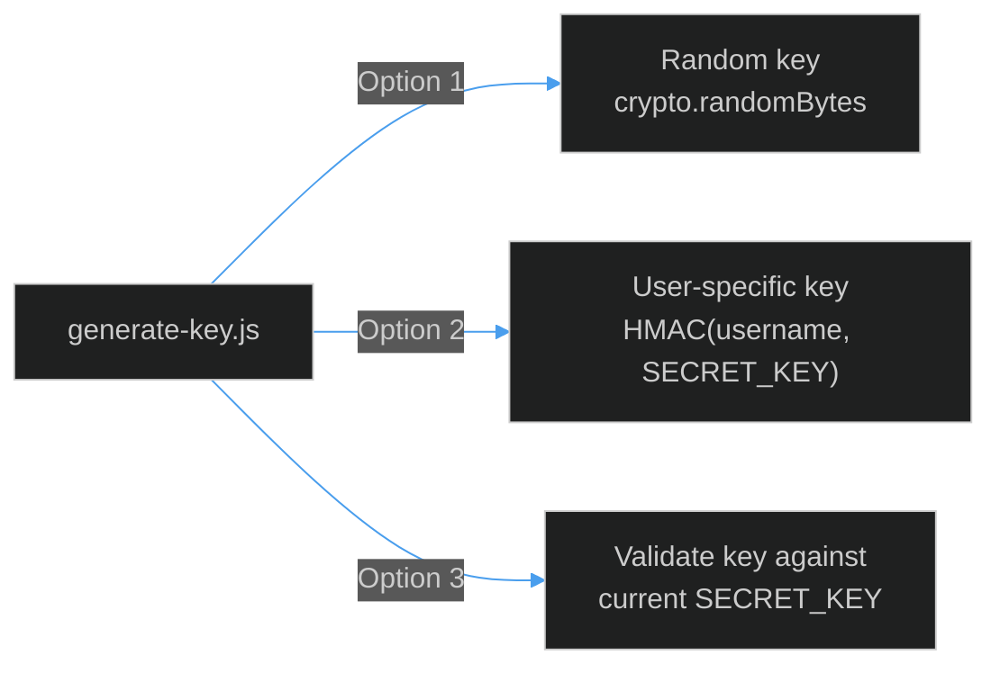
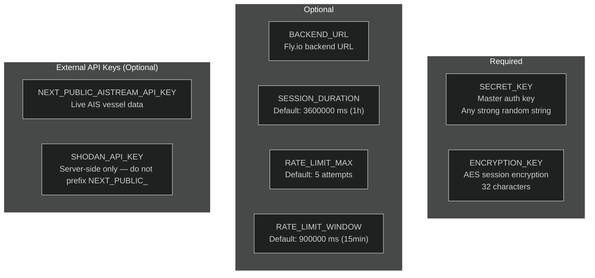
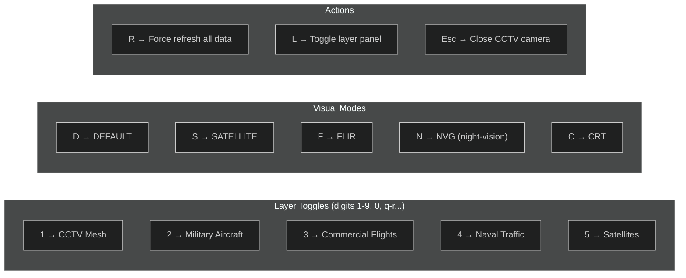

# Quick Reference

All essential commands, URLs, ports, keyboard shortcuts, and environment variables in one page.

---

## Commands

### Development

```bash
pnpm dev          # Start dev server → http://localhost:3000
pnpm build        # Production build (SWC minify)
pnpm start        # Start production server → http://localhost:3000
pnpm lint         # ESLint check
```

### Key Management

```bash
node scripts/generate-key.js   # Interactive: generate / derive user key / validate
```



### Vercel / Deployment

```bash
npm i -g vercel
vercel login
vercel --prod                          # Manual production deploy
vercel env add SECRET_KEY              # Add env var interactively
vercel logs --follow                   # Tail live logs
vercel env pull .env.local             # Pull env vars locally
```

### Fly.io (Optional Backend)

```bash
fly apps create shadowbroker-backend
fly secrets set DATABASE_URL=...
fly deploy
fly scale count 1 --app shadowbroker-backend   # 24/7 uptime
fly logs --app shadowbroker-backend
```

---

## URLs & Ports

| Environment | URL | Port |
|-------------|-----|------|
| Local dev | `http://localhost:3000` | 3000 |
| Local dashboard | `http://localhost:3000/dashboard` | 3000 |
| Local auth API | `http://localhost:3000/api/auth/validate` | 3000 |
| Production (current) | `https://subterfuge-shadowbroker-*.vercel.app` | 443 |
| Fly.io backend (optional) | `https://shadowbroker-backend.fly.dev` | 443 |

---

## Environment Variables Cheatsheet



| Variable | Required | Default | Notes |
|----------|----------|---------|-------|
| `SECRET_KEY` | ✅ | — | Master key; users enter this at login |
| `ENCRYPTION_KEY` | ✅ | — | 32-char AES key for session tokens |
| `BACKEND_URL` | ❌ | — | External Shadowbroker API endpoint |
| `SESSION_DURATION` | ❌ | `3600000` | Session TTL in milliseconds |
| `RATE_LIMIT_MAX` | ❌ | `5` | Max auth attempts per window |
| `RATE_LIMIT_WINDOW` | ❌ | `900000` | Rate-limit window in milliseconds |
| `NEXT_PUBLIC_AISTREAM_API_KEY` | ❌ | — | Live AIS data from aisstream.io |
| `SHODAN_API_KEY` | ❌ | — | Shodan device search (server-proxied) |

---

## API Routes

| Route | Method | Auth | Purpose |
|-------|--------|------|---------|
| `/api/auth/validate` | `POST` | None | Submit secret key → receives session cookie |
| `/api/auth/session` | `GET` | Cookie | Check if current session is valid |
| `/api/proxy/shodan` | `GET` | Cookie | Proxied Shodan query (hides API key) |

**Validate request body:**
```json
{ "key": "your-secret-key-here" }
```

**Session check response:**
```json
{ "valid": true }
```

---

## Keyboard Shortcuts (Dashboard)

From [`src/components/panels/KeyboardShortcuts.tsx`](https://github.com/AReid987/shadowbroker-deployment/blob/main/src/components/panels/KeyboardShortcuts.tsx#L1):



---

## Hidden Auth Triggers

Three ways to reveal the authentication modal (from [`DecoyLanding.tsx:8`](https://github.com/AReid987/shadowbroker-deployment/blob/main/src/components/landing/DecoyLanding.tsx#L8)):

| Trigger | Sequence |
|---------|---------|
| **Konami Code** | ↑ ↑ ↓ ↓ ← → ← → B A |
| **Click sequence** | Click copyright/footer text 5× within 3 seconds |
| **Direct URL** | Navigate to `/login` or call the API directly |

---

## Visual Modes

| Mode | Effect | Use Case |
|------|--------|---------|
| `DEFAULT` | Standard dark satellite map | General OSINT |
| `SATELLITE` | High-res satellite imagery base | Terrain analysis |
| `FLIR` | Forward-looking infrared palette | Heat signature emulation |
| `NVG` | Night-vision green phosphor | Low-light emulation |
| `CRT` | Scanline / retro terminal overlay | Aesthetic / presentation |

---

## Layer Categories & IDs

| ID | Name | Default | Category |
|----|------|---------|---------|
| `cctv` | CCTV Mesh (900+) | ON | Surveillance |
| `flights_military` | Military Aircraft | ON | Aviation |
| `flights_commercial` | Commercial Flights | off | Aviation |
| `ships` | Naval Traffic (20) | off | Maritime |
| `carriers` | Carrier Groups (20) | off | Maritime |
| `trains` | Rail Tracking (19) | off | Ground |
| `satellites` | Satellites (24) | off | Space |
| `radios` | KiwiSDR Scanners (21) | off | SIGINT |
| `mesh` | Mesh / APRS (26) | off | SIGINT |
| `gps_jamming` | GPS Jamming (15) | off | SIGINT |
| `earthquakes` | Earthquakes (USGS) | ON | Environment |
| `volcanoes` | Volcanoes (60) | ON | Environment |
| `fires` | Fire Hotspots (16) | off | Environment |
| `weather` | Severe Weather (10) | off | Environment |
| `air_quality` | Air Quality (OpenAQ) | off | Environment |
| `infrastructure_bases` | Military Bases (200+) | off | Infrastructure |
| `infrastructure_power` | Power Plants (500+) | off | Infrastructure |
| `infrastructure_datacenters` | Data Centers (30) | off | Infrastructure |
| `outages` | Internet Outages (15) | off | Infrastructure |
| `conflict` | Conflict Zones (15) | off | Geopolitics |
| `daynight` | Day/Night Terminator | ON | Overlays |
| `shodan` | Shodan Devices | off | Overlays |

---

## URL State Persistence

The dashboard syncs active layers and visual mode to the URL query string:

```
/dashboard?layers=cctv,flights_military,earthquakes&mode=FLIR
```

This allows bookmarking or sharing specific configurations. State is debounced 300 ms before URL update ([`dashboard/page.tsx:72`](https://github.com/AReid987/shadowbroker-deployment/blob/main/src/app/dashboard/page.tsx#L72)).

---

## Status Bar Indicators

Bottom of the tactical display ([`dashboard/page.tsx:254`](https://github.com/AReid987/shadowbroker-deployment/blob/main/src/app/dashboard/page.tsx#L254)):

```
[N] LAYERS ACTIVE | MODE: [mode] | [N] CAMERAS | [N] MIL AIR | [N] CIV AIR | [N] VESSELS | [N] CSG | [N] CONFLICTS | BLACKTIVISM v0.4
```

Layer health dots in the left panel:
- 🟢 Green: source responding
- 🟡 Amber: source degraded  
- 🔴 Red: source offline
- ⚫ Grey: unknown / loading

<!-- Sources: src/components/panels/LayerPanel.tsx:38, src/app/dashboard/page.tsx:72, src/components/landing/DecoyLanding.tsx:8, src/middleware.ts:23, src/lib/rateLimit.ts:11 -->
