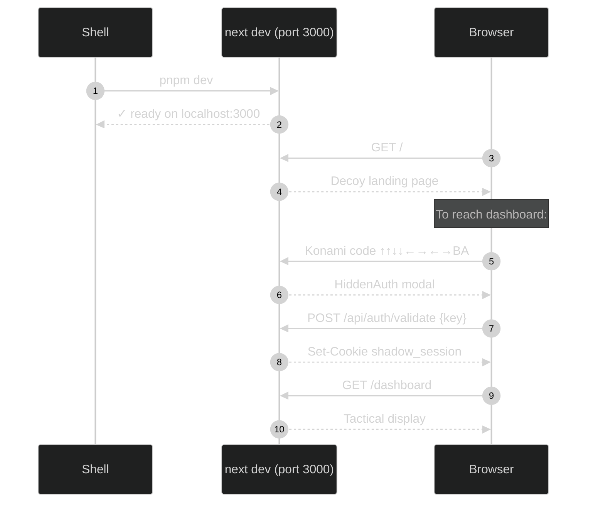
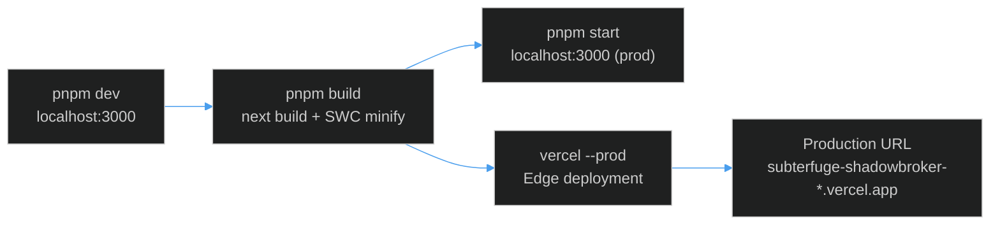
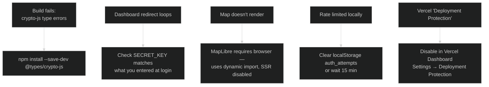

# Dev Environment Setup

This guide walks you through getting BLACKTIVISM running locally from a cold start.

---

## Prerequisites

| Requirement | Minimum | Notes |
|-------------|---------|-------|
| Node.js | 18.x LTS | 20.x recommended |
| Package manager | pnpm 8+ | `npm` also works |
| Git | Any recent | For cloning |
| A terminal | — | zsh / bash |

> No Docker, no database, no external services required for local development. All data fetchers have fallback static datasets.

---

## 1. Clone & Install

```bash
git clone git@github.com:AReid987/shadowbroker-deployment.git
cd shadowbroker-deployment

# Preferred (pnpm)
pnpm install

# Fallback (npm)
npm install
```

Dependencies installed ([`package.json:11`](https://github.com/AReid987/shadowbroker-deployment/blob/main/package.json#L11)):

| Package | Version | Purpose |
|---------|---------|---------|
| `next` | 14.0.4 | Framework |
| `react` / `react-dom` | ^18.2.0 | UI runtime |
| `crypto-js` | ^4.2.0 | AES session encryption, SHA-256 key hash |
| `lucide-react` | ^0.294.0 | Icon system |
| `framer-motion` | ^10.16.16 | Decoy page animations |
| `clsx` | ^2.0.0 | Class merging utility |

---

## 2. Environment Variables

Copy the example and fill in your values:

```bash
cp .env.example .env.local
```

**`.env.example`** ([full file](https://github.com/AReid987/shadowbroker-deployment/blob/main/src/lib/auth.ts#L5)):

```env
# Required — master access key (any strong random string)
SECRET_KEY=your-secret-key-here-change-this

# Required — 32-character AES encryption key for session tokens
ENCRYPTION_KEY=your-32-character-encryption-key-here

# Optional — backend URL (only needed if using Fly.io backend)
BACKEND_URL=https://your-shadowbroker-backend.com

# Optional — rate limiting config
RATE_LIMIT_MAX=5          # max attempts per window (default: 5)
RATE_LIMIT_WINDOW=900000  # window in ms — 15 minutes (default)

# Optional — session duration
SESSION_DURATION=3600000  # 1 hour in ms (default)
```

### Generating Secure Keys

```bash
# Generate a SECRET_KEY (32+ random characters)
node -e "console.log(require('crypto').randomBytes(32).toString('hex'))"

# Generate an ENCRYPTION_KEY (exactly 32 chars works best)
node -e "console.log(require('crypto').randomBytes(16).toString('hex'))"
```

Or use the built-in key management script:

```bash
node scripts/generate-key.js
# Interactive menu: generate / derive user key / validate
```

---

## 3. Start the Dev Server

```bash
pnpm dev
# or: npm run dev
```

The app starts on **`http://localhost:3000`**.



---

## 4. How Authentication Works Locally

[`src/middleware.ts:4`](https://github.com/AReid987/shadowbroker-deployment/blob/main/src/middleware.ts#L4) guards the `/dashboard` route. The middleware checks for a `shadow_session` cookie. Without it, any direct visit to `/dashboard` is redirected to `/`.

To authenticate locally:

1. Open `http://localhost:3000`
2. Either:
   - Type the **Konami code** (↑↑↓↓←→←→B A) — [`DecoyLanding.tsx:8`](https://github.com/AReid987/shadowbroker-deployment/blob/main/src/components/landing/DecoyLanding.tsx#L8)
   - Click the **copyright/footer text 5× rapidly** — triggers `CovertLogin`
   - Navigate directly to `/login` or `/api/auth/validate` is accessible (API route)
3. Enter your `SECRET_KEY` value from `.env.local`
4. You will be redirected to `/dashboard`

---

## 5. Optional API Keys

The following environment variables unlock live data (not required for dev):

```env
# AIS vessel tracking — live ship positions (aisstream.io)
NEXT_PUBLIC_AISTREAM_API_KEY=your-key

# Shodan device intelligence — must be server-only (proxied via /api/proxy/shodan)
SHODAN_API_KEY=your-key
```

Without these keys, the relevant layers fall back to realistic static datasets defined in [`src/lib/data/vessels.ts:53`](https://github.com/AReid987/shadowbroker-deployment/blob/main/src/lib/data/vessels.ts#L53).

---

## 6. Build & Production

```bash
# Build
pnpm build  # or: npm run build

# Start production server
pnpm start  # or: npm start

# Lint
pnpm lint   # or: npm run lint
```



---

## 7. Vercel Deployment

The project auto-deploys via GitHub Actions on push to `main` ([`DEPLOYMENT.md:46`](https://github.com/AReid987/shadowbroker-deployment/blob/main/DEPLOYMENT.md#L46)).

Required Vercel secrets (set in GitHub Secrets or Vercel dashboard):

```
SECRET_KEY
ENCRYPTION_KEY
BACKEND_URL
SESSION_DURATION
RATE_LIMIT_MAX
RATE_LIMIT_WINDOW
VERCEL_TOKEN
VERCEL_ORG_ID      → team_DE0eCny4qE63Df3PfvvH4cCR
VERCEL_PROJECT_ID  → prj_INQCJ4C9kwIHMZJfaeltTlx3TDbh
```

Manual deploy:
```bash
npm i -g vercel
vercel --prod
```

---

## 8. Security Headers (Pre-configured)

[`next.config.js:18`](https://github.com/AReid987/shadowbroker-deployment/blob/main/next.config.js#L18) sets the following headers on every response:

| Header | Value |
|--------|-------|
| `Strict-Transport-Security` | `max-age=63072000; includeSubDomains; preload` |
| `X-Frame-Options` | `SAMEORIGIN` |
| `X-Content-Type-Options` | `nosniff` |
| `X-XSS-Protection` | `1; mode=block` |
| `Referrer-Policy` | `strict-origin-when-cross-origin` |
| `Content-Security-Policy` | Restricts scripts to `self` + Google Fonts |

---

## Common Setup Issues



| Issue | Cause | Fix |
|-------|-------|-----|
| `crypto-js` type errors | Missing type declarations | `npm install --save-dev @types/crypto-js` |
| Dashboard loops back to `/` | Invalid/missing session cookie | Re-authenticate with correct `SECRET_KEY` |
| Map doesn't load | SSR / MapLibre incompatibility | Already handled via `dynamic(() => import(...), { ssr: false })` — check browser console |
| Fly.io 502 errors | Backend binding issue | Ensure backend binds `0.0.0.0`, not `127.0.0.1` |
| Rate limited | >5 failed auth attempts | Wait 15 min or `localStorage.removeItem('auth_attempts')` |

<!-- Sources: package.json:11, src/middleware.ts:4, .env.example:1, next.config.js:18, src/components/landing/DecoyLanding.tsx:8 -->
