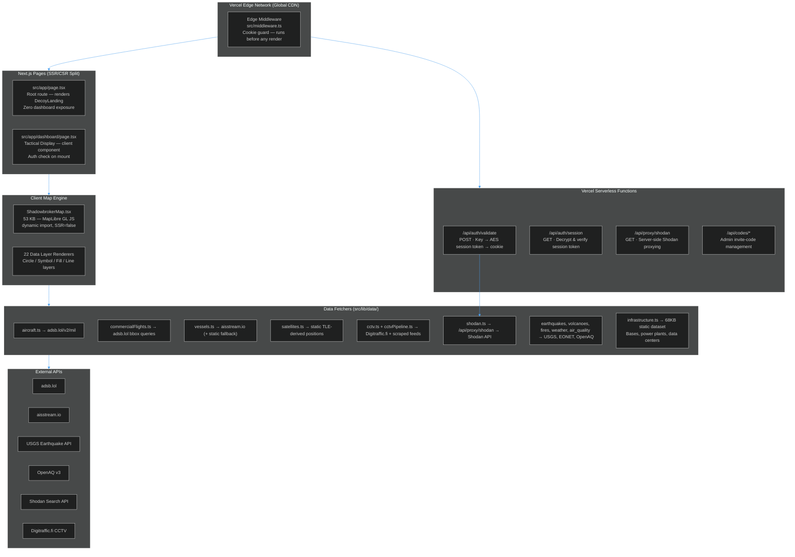
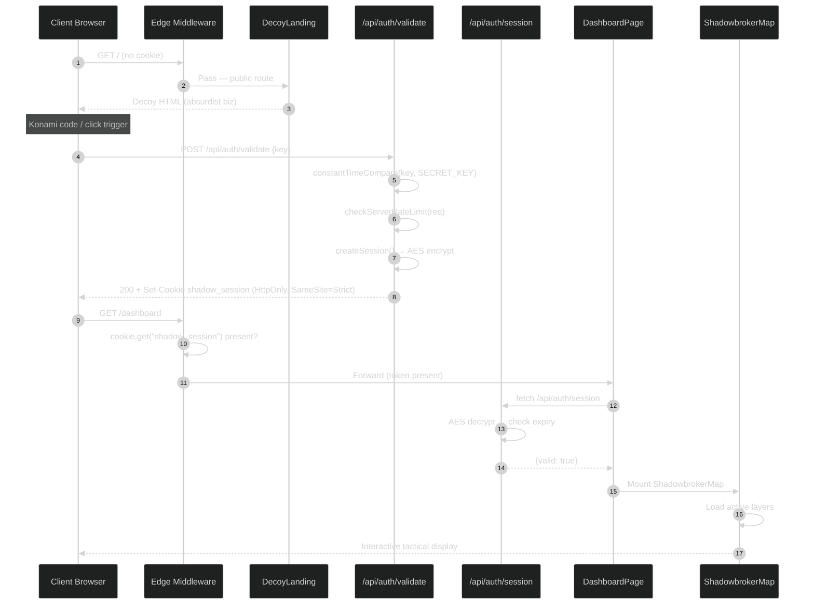
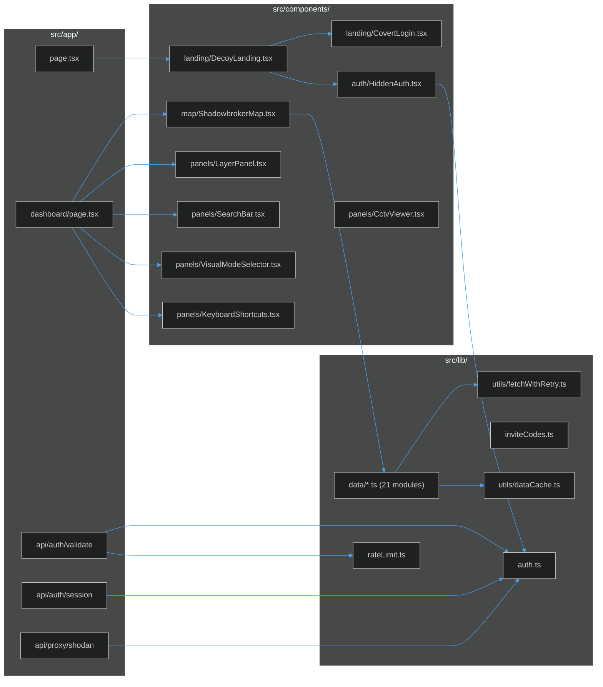
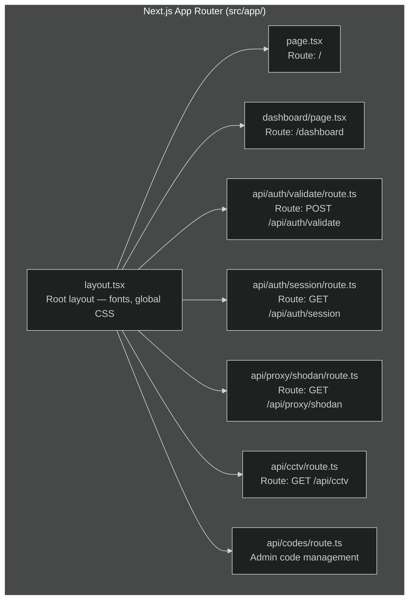

# System Architecture

A deep-dive into the structural decisions behind BLACKTIVISM — layered from infrastructure down to runtime data flow.

---

## Deployment Topology



---

## Request Lifecycle



---

## Module Dependency Graph



---

## Next.js App Router Structure



---

## Key Architectural Decisions

### 1. Dual-Identity Architecture

The core security insight: the decoy page and the dashboard share the same Next.js process, same Vercel deployment, same domain. Route protection is entirely cookie-based at the edge middleware layer.

This means:
- No separate servers to maintain
- Single Vercel project, single deploy
- The decoy page has zero references to dashboard code in its bundle
- Middleware runs before RSC rendering — no dashboard code leaks to unauthenticated requests

Reference: [`src/middleware.ts:4`](https://github.com/AReid987/shadowbroker-deployment/blob/main/src/middleware.ts#L4)

### 2. MapLibre via Dynamic Import

`ShadowbrokerMap` is a 53KB component that imports MapLibre GL JS. MapLibre uses browser APIs (`window.devicePixelRatio`, WebGL context) that are unavailable in Node.js. The solution:

```ts
const ShadowbrokerMap = dynamic(
  () => import('@/components/map/ShadowbrokerMap'),
  { ssr: false }
)
```

Reference: [`src/app/dashboard/page.tsx:15`](https://github.com/AReid987/shadowbroker-deployment/blob/main/src/app/dashboard/page.tsx#L15)

### 3. Stateless Authentication

No database, no user table. Auth state is entirely encoded in an AES-encrypted cookie:

```json
{
  "keyHash": "sha256(key + SECRET_KEY)",
  "timestamp": 1716000000000,
  "expiry":    1716003600000
}
```

Session validity = `Date.now() < expiry`. No server-side session store. This works because the encryption key is the source of truth.

Reference: [`src/lib/auth.ts:48`](https://github.com/AReid987/shadowbroker-deployment/blob/main/src/lib/auth.ts#L48)

### 4. Data Fetcher Resilience Pattern

Every data module follows: **live API → in-memory cache → static fallback**.

```ts
// Pattern in aircraft.ts, vessels.ts, cctv.ts, etc.
try {
  const res = await fetchWithRetry(URL, { retries: 2, timeout: 8000 })
  const result = transformData(await res.json())
  setCache(KEY, result)         // localStorage cache
  return result
} catch (err) {
  return getCache(KEY) || STATIC_FALLBACK
}
```

Reference: [`src/lib/data/aircraft.ts:16`](https://github.com/AReid987/shadowbroker-deployment/blob/main/src/lib/data/aircraft.ts#L16)

---

## Performance Characteristics

| Aspect | Approach |
|--------|---------|
| Initial load | Decoy page only — map bundle excluded from unauthenticated sessions |
| Map bundle | Dynamic import (code-split) — loads on `/dashboard` only |
| Data freshness | Client-side polling per layer; 5-min `localStorage` TTL |
| Security | AES-256 session tokens; SHA-256 key hashing; constant-time comparison |
| Static assets | Vercel CDN; `image/avif` + `image/webp` formats |

<!-- Sources: src/middleware.ts:4, src/app/dashboard/page.tsx:15, src/lib/auth.ts:48, src/lib/data/aircraft.ts:16, src/lib/utils/fetchWithRetry.ts:7 -->
