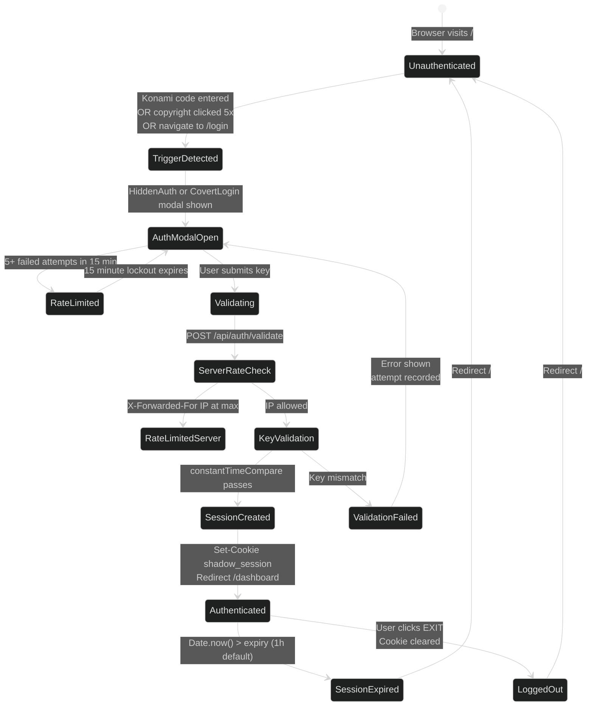
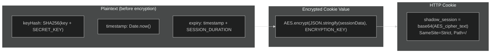
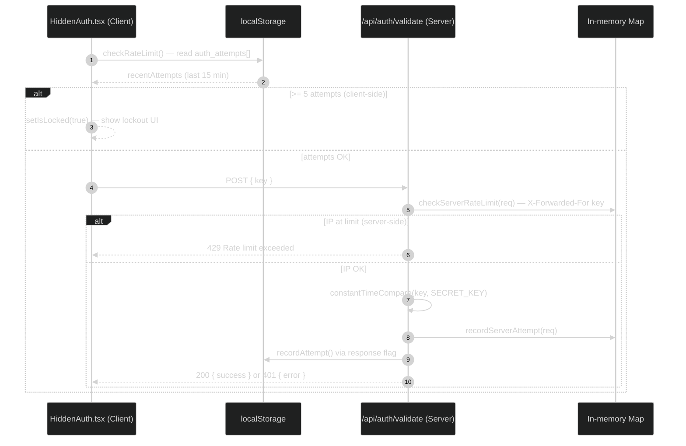
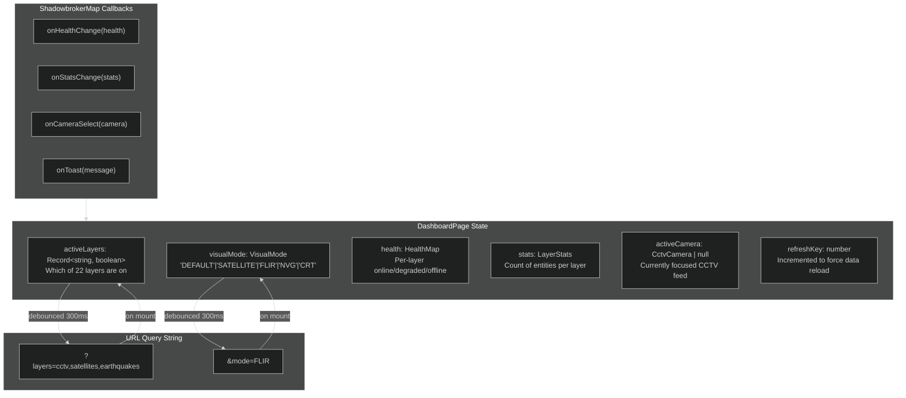
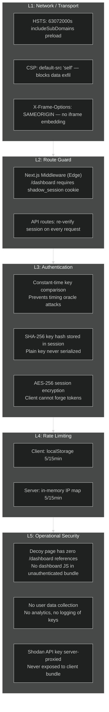

# Business Logic

This page documents the authentication system, session management, rate limiting, invite code system, and URL state management that form the operational core of BLACKTIVISM.

---

## Authentication Flow — Complete State Machine



---

## Key Validation — Constant-Time Comparison

The core security primitive that prevents timing attacks ([`src/lib/auth.ts:34`](https://github.com/AReid987/shadowbroker-deployment/blob/main/src/lib/auth.ts#L34)):

```ts
function constantTimeCompare(a: string, b: string): boolean {
  if (a.length !== b.length) {
    return false  // length leak is acceptable — attacker already knows key format
  }
  let result = 0
  for (let i = 0; i < a.length; i++) {
    result |= a.charCodeAt(i) ^ b.charCodeAt(i)  // XOR each char
  }
  return result === 0  // 0 = all chars matched
}
```

**Why this matters**: A naive `===` string comparison short-circuits on the first mismatch. An attacker can measure response time to enumerate valid key prefixes character by character. XOR-based comparison always processes all characters.

---

## Session Token Structure

Sessions are AES-encrypted with `ENCRYPTION_KEY` ([`src/lib/auth.ts:48`](https://github.com/AReid987/shadowbroker-deployment/blob/main/src/lib/auth.ts#L48)):



Validation is pure decryption + expiry check:

```ts
const decrypted = CryptoJS.AES.decrypt(token, ENCRYPTION_KEY)
const sessionData = JSON.parse(decrypted.toString(CryptoJS.enc.Utf8))
if (Date.now() > sessionData.expiry) return false
return true
```

No server-side session store. The encryption key is the source of truth.

---

## Rate Limiting — Dual Layer



**Client-side** ([`src/lib/auth.ts:110`](https://github.com/AReid987/shadowbroker-deployment/blob/main/src/lib/auth.ts#L110)):
- Tracks timestamps of attempts in `localStorage.auth_attempts`
- Window: 15 minutes
- Max: 5 attempts
- Locks UI immediately on threshold

**Server-side** ([`src/lib/rateLimit.ts:21`](https://github.com/AReid987/shadowbroker-deployment/blob/main/src/lib/rateLimit.ts#L21)):
- In-memory `Map<string, AttemptRecord>`
- Keyed by `X-Forwarded-For` IP (falls back to `'anonymous'`)
- Same 5/15-min policy
- Lives for serverless function instance lifetime

> **Caveat**: Server-side rate limiter resets on cold starts in serverless. For production hardening, swap to Redis or KV store.

---

## Invite Code System

A secondary access layer built on top of the master `SECRET_KEY`. Invite codes are ephemeral, server-memory-only ([`src/lib/inviteCodes.ts:1`](https://github.com/AReid987/shadowbroker-deployment/blob/main/src/lib/inviteCodes.ts#L1)):

```mermaid
%%{init: {'theme': 'dark', 'themeVariables': {'primaryColor': '#1e3a5f', 'primaryTextColor': '#e0e0e0', 'primaryBorderColor': '#4a9eed'}}}%%
erDiagram
    CODE {
        string code "12 chars, alphanumeric, crypto.randomBytes"
        string created_at "ISO timestamp"
        string label "Human-readable name"
        number uses "Incremented on each valid use"
    }
    SET["_validCodes (Set)"] ||--o{ CODE : "tracks"
    MAP["_codeMetadata (Map)"] ||--o{ CODE : "stores meta"
```

Operations:
- `createCode(label)` — generates 12-char random code, adds to `_validCodes`
- `revokeCode(code)` — removes from both `_validCodes` and `_codeMetadata`  
- `validateCode(code)` — checks presence, increments `uses`
- `listCodes()` — admin listing for `/api/codes`

---

## Dashboard State Management

The dashboard uses React `useState` + URL query params for state persistence. No external state library.



Reference: [`src/app/dashboard/page.tsx:37`](https://github.com/AReid987/shadowbroker-deployment/blob/main/src/app/dashboard/page.tsx#L37)

---

## Logout & Session Clearing

Logout is client-side cookie deletion ([`dashboard/page.tsx:118`](https://github.com/AReid987/shadowbroker-deployment/blob/main/src/app/dashboard/page.tsx#L118)):

```ts
const handleLogout = () => {
  document.cookie = 'shadow_session=; Path=/; Max-Age=0; SameSite=Strict'
  window.location.href = '/'
}
```

Setting `Max-Age=0` tells the browser to immediately expire the cookie. The server never needs to invalidate it — the next request to `/dashboard` will find no cookie and be redirected by the middleware.

---

## Security Layer Summary



<!-- Sources: src/lib/auth.ts:34, src/lib/auth.ts:48, src/lib/rateLimit.ts:21, src/lib/inviteCodes.ts:1, src/app/dashboard/page.tsx:37 -->
