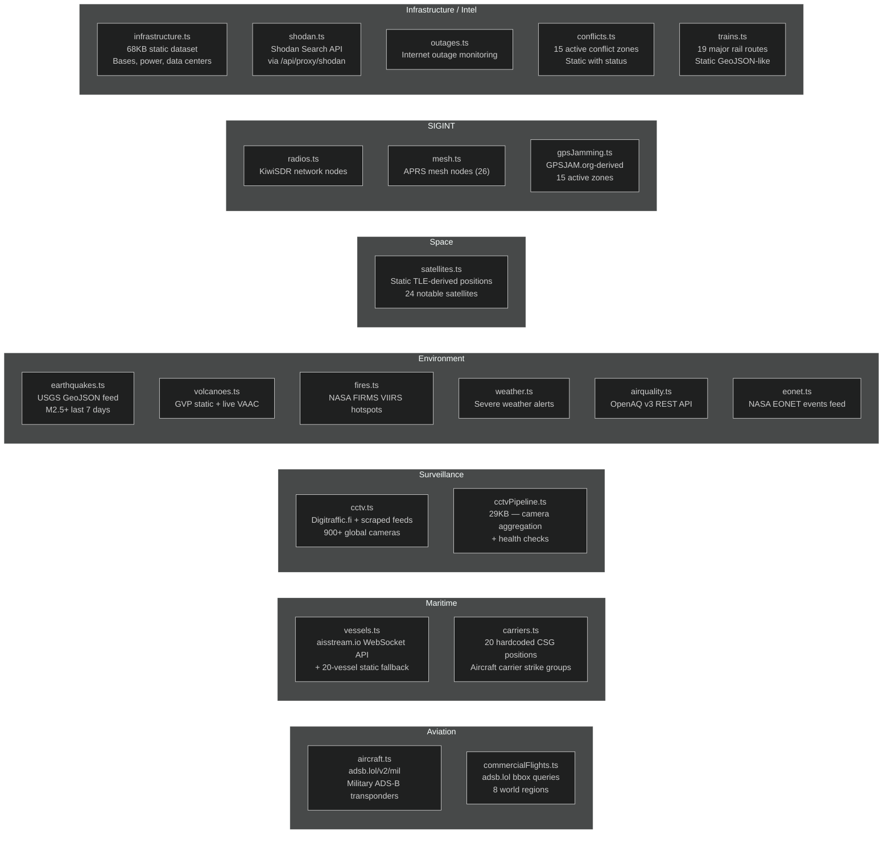
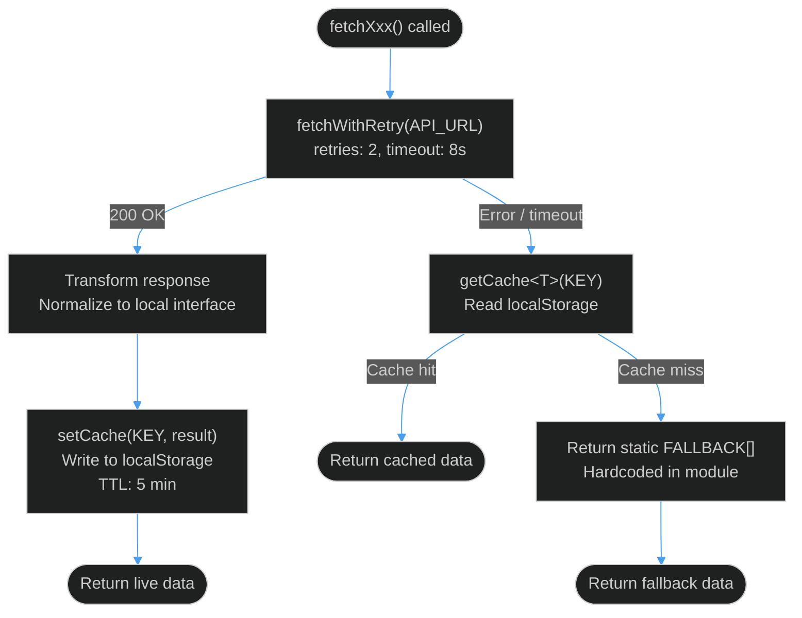
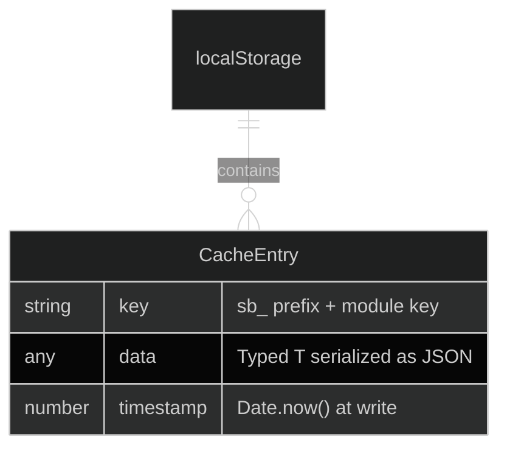
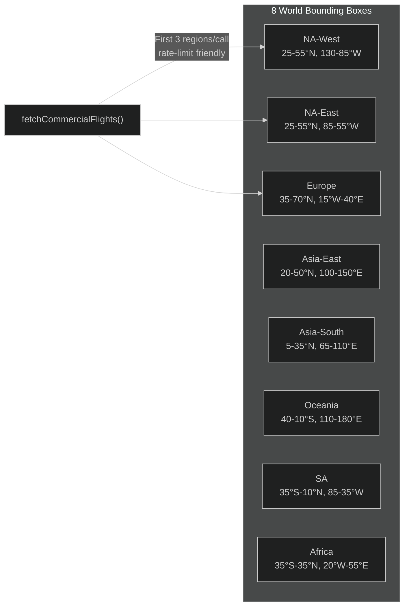

# Data Layer

This page covers every data source, fetch strategy, caching model, and transformation pipeline in BLACKTIVISM. All data modules live in [`src/lib/data/`](https://github.com/AReid987/shadowbroker-deployment/blob/main/src/lib/data).

---

## Data Source Inventory



---

## Fetch Resilience Pattern

Every data module uses the same three-tier fetch pattern:



Implementation reference — [`src/lib/utils/fetchWithRetry.ts:7`](https://github.com/AReid987/shadowbroker-deployment/blob/main/src/lib/utils/fetchWithRetry.ts#L7):

```ts
export async function fetchWithRetry(
  url: string,
  options: RequestInit & FetchOptions = {}
): Promise<Response> {
  const { retries = 3, backoff = 1000, timeout = 10000, ...fetchOptions } = options
  // AbortController timeout + exponential-ish backoff
}
```

---

## Cache Architecture



Cache keys (prefix `sb_`):

| Module | Cache Key | TTL |
|--------|-----------|-----|
| `aircraft.ts` | `sb_military_aircraft` | 5 min |
| `vessels.ts` | `sb_vessels` | 5 min |
| `shodan.ts` | `sb_shodan_{query}` | 5 min |
| `cctv.ts` | `sb_cctv` | 5 min |

Reference: [`src/lib/utils/dataCache.ts:2`](https://github.com/AReid987/shadowbroker-deployment/blob/main/src/lib/utils/dataCache.ts#L2)

> **Note**: Cache lives in `localStorage` — client-side only. Server-side data fetchers bypass cache (they don't have access to `window`). The guard is `if (typeof window === 'undefined') return null`.

---

## Data Interfaces

### Aircraft (Military)
From [`src/lib/data/aircraft.ts:1`](https://github.com/AReid987/shadowbroker-deployment/blob/main/src/lib/data/aircraft.ts#L1):
```ts
interface Aircraft {
  hex: string        // ICAO transponder code
  lat: number
  lng: number
  altitude: number   // feet (baro)
  speed: number      // ground speed knots
  heading: number    // degrees
  callsign?: string
  type?: string      // ICAO aircraft type code
  category?: string
}
```

### Vessel (AIS)
From [`src/lib/data/vessels.ts:4`](https://github.com/AReid987/shadowbroker-deployment/blob/main/src/lib/data/vessels.ts#L4):
```ts
interface Vessel {
  mmsi: number       // Maritime Mobile Service Identity
  name: string
  lat: number
  lng: number
  speed: number      // knots (SOG)
  heading: number    // degrees (COG)
  type: string       // Ship category string
  flag?: string      // ISO 3166-1 alpha-2 country code
  destination?: string
  eta?: string
}
```

### CCTV Camera
From [`src/lib/data/cctv.ts:1`](https://github.com/AReid987/shadowbroker-deployment/blob/main/src/lib/data/cctv.ts#L1):
```ts
interface CctvCamera {
  id: string
  name: string
  lat: number
  lng: number
  url: string
  type: 'mjpeg' | 'image' | 'hls' | 'embed'
  country: string
  city: string
  refreshInterval?: number   // seconds between frame refreshes
  region?: string
}
```

### Satellite
From [`src/lib/data/satellites.ts:1`](https://github.com/AReid987/shadowbroker-deployment/blob/main/src/lib/data/satellites.ts#L1):
```ts
interface Satellite {
  name: string
  noradId: number    // NORAD catalog number
  lat: number
  lng: number
  altitude: number   // km
  type: string       // 'Space Station' | 'Reconnaissance' | 'Navigation' | etc.
  operator: string
  launchYear: number
}
```

### Shodan Host
From [`src/lib/data/shodan.ts:4`](https://github.com/AReid987/shadowbroker-deployment/blob/main/src/lib/data/shodan.ts#L4):
```ts
interface ShodanHost {
  ip_str: string
  latitude: number
  longitude: number
  city?: string
  country_code?: string
  org?: string
  isp?: string
  os?: string
  ports: number[]
  hostnames: string[]
  product?: string
  version?: string
  vulns?: string[]   // CVE IDs if Shodan detected vulnerabilities
}
```

---

## Commercial Flights — World Bounding Box Strategy

Commercial flights use a bounding-box approach across 8 world regions to avoid single-request rate limits on adsb.lol ([`commercialFlights.ts:20`](https://github.com/AReid987/shadowbroker-deployment/blob/main/src/lib/data/commercialFlights.ts#L20)):



---

## Layer Health Monitoring

[`src/lib/utils/useDataHealth.ts`](https://github.com/AReid987/shadowbroker-deployment/blob/main/src/lib/utils/useDataHealth.ts) tracks the status of each active data source. `ShadowbrokerMap` calls `onHealthChange(healthMap)` when a fetch succeeds or fails. The `LayerPanel` renders a colored dot per layer:

- **Green** (`online`): last fetch succeeded
- **Amber** (`degraded`): fetch succeeded but data quality low
- **Red** (`offline`): last fetch failed, serving cache or fallback

<!-- Sources: src/lib/data/aircraft.ts:1, src/lib/data/vessels.ts:4, src/lib/data/cctv.ts:1, src/lib/utils/dataCache.ts:2, src/lib/utils/fetchWithRetry.ts:7 -->
