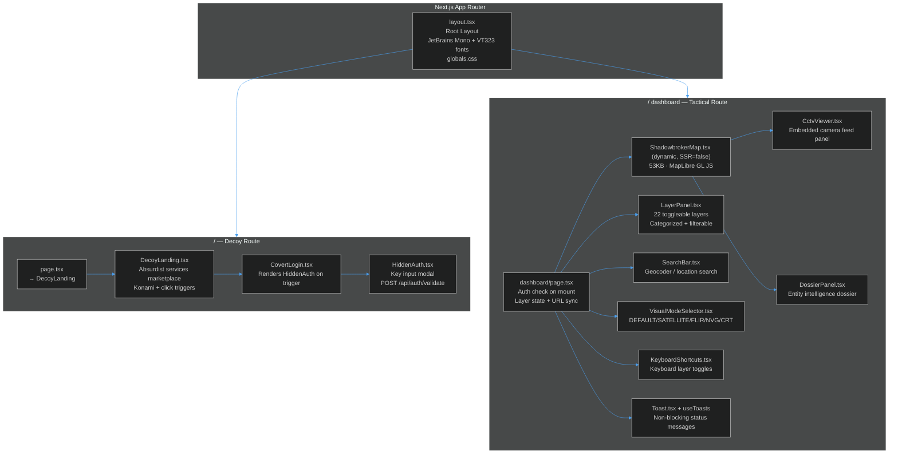
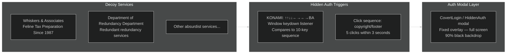
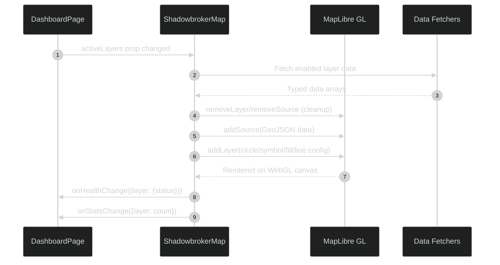
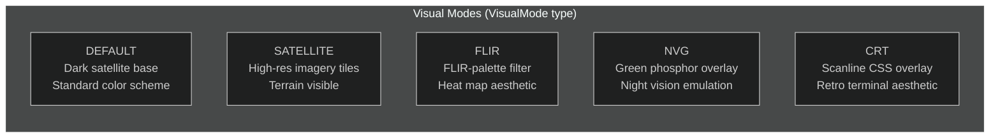
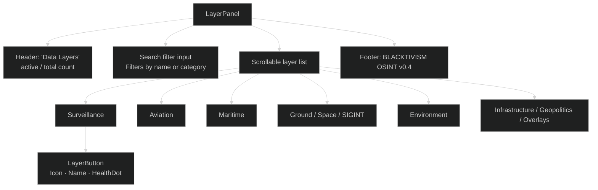
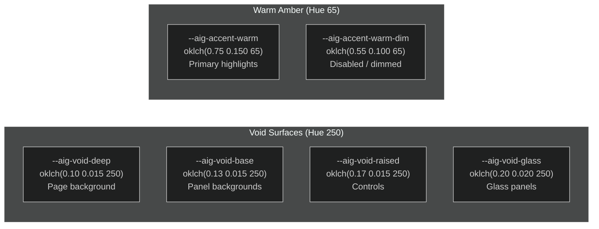

# Frontend Architecture

A deep dive into the UI layer — the decoy landing page, the tactical dashboard, map rendering engine, component hierarchy, and the Aigency design system.

---

## Component Tree



---

## DecoyLanding — The Cover Story

The decoy page ([`src/components/landing/DecoyLanding.tsx`](https://github.com/AReid987/shadowbroker-deployment/blob/main/src/components/landing/DecoyLanding.tsx#L1)) presents as a marketplace for absurdist commercial services. It is entirely convincing as a legitimate (if eccentric) website.



Konami code implementation ([`DecoyLanding.tsx:8`](https://github.com/AReid987/shadowbroker-deployment/blob/main/src/components/landing/DecoyLanding.tsx#L8)):
```ts
const KONAMI = [
  "ArrowUp","ArrowUp","ArrowDown","ArrowDown",
  "ArrowLeft","ArrowRight","ArrowLeft","ArrowRight",
  "b","a",
]
```

Framer Motion animates the service cards and page transitions. The page has no visual indication of the hidden functionality.

---

## ShadowbrokerMap — Tactical Display Engine

The 53KB map component ([`src/components/map/ShadowbrokerMap.tsx`](https://github.com/AReid987/shadowbroker-deployment/blob/main/src/components/map/ShadowbrokerMap.tsx#L1)) is the heart of the platform. It:

1. Initializes a MapLibre GL JS instance with dark base tile styling
2. Subscribes to `activeLayers` prop changes
3. For each active layer, calls the corresponding data fetcher
4. Renders fetched data as MapLibre layers (Circle, Symbol, Fill, Line)
5. Reports health status and entity counts via callbacks



---

## Visual Mode System

Five rendering modes applied via CSS class on the map container ([`VisualModeSelector.tsx`](https://github.com/AReid987/shadowbroker-deployment/blob/main/src/components/panels/VisualModeSelector.tsx#L1)):



Mode is passed as prop to `ShadowbrokerMap` and synced to the URL: `?mode=FLIR`.

---

## LayerPanel — Intelligence Layer Control

The 264px-wide sidebar ([`src/components/panels/LayerPanel.tsx`](https://github.com/AReid987/shadowbroker-deployment/blob/main/src/components/panels/LayerPanel.tsx#L97)) renders all 22 layer toggles grouped by category with a live search filter.



Health dot logic ([`LayerPanel.tsx:88`](https://github.com/AReid987/shadowbroker-deployment/blob/main/src/components/panels/LayerPanel.tsx#L88)):
```ts
const healthDot = (status?: string) => {
  switch (status) {
    case 'online':   return 'bg-green-500'
    case 'degraded': return 'bg-amber-500'
    case 'offline':  return 'bg-red-500'
    default:         return 'bg-gray-700'
  }
}
```

---

## Aigency Design System — OKLCH Color Tokens

From [`ARCHITECTURE.md:22`](https://github.com/AReid987/shadowbroker-deployment/blob/main/ARCHITECTURE.md#L22) and [`src/app/globals.css`](https://github.com/AReid987/shadowbroker-deployment/blob/main/src/app/globals.css):



**Typography Stack** (from `ARCHITECTURE.md:38`):
- `JetBrains Mono` — primary dashboard font
- `VT323` — TTY display indicators
- `Share Tech Mono` — fallback display font
- All three loaded via Google Fonts in `layout.tsx`

**Design Constraints**:
- `border-radius: 0px` on all instrument surfaces (sharp corners)
- No drop shadows inside glass layouts
- Bayer matrix dither via `.glass-surface` CSS class applied to dashboard root ([`dashboard/page.tsx:157`](https://github.com/AReid987/shadowbroker-deployment/blob/main/src/app/dashboard/page.tsx#L157))

---

## Top Bar Layout

```
┌──────────────────────────────────────────────────────────────────────┐
│ BLACKTIVISM  ●  SECURE CONNECTION  │  N/M SOURCES  │  UTC TIMESTAMP  │
│                                    SearchBar  KBD  Mode  ↺  Layers  EXIT │
└──────────────────────────────────────────────────────────────────────┘
```

Reference: [`dashboard/page.tsx:158`](https://github.com/AReid987/shadowbroker-deployment/blob/main/src/app/dashboard/page.tsx#L158)

## Bottom Status Bar

```
┌──────────────────────────────────────────────────────────────────────┐
│ N LAYERS ACTIVE  │  MODE: X  │  N CAMERAS  │  N MIL AIR  │  ...     │
│                                              BLACKTIVISM v0.4        │
└──────────────────────────────────────────────────────────────────────┘
```

Reference: [`dashboard/page.tsx:254`](https://github.com/AReid987/shadowbroker-deployment/blob/main/src/app/dashboard/page.tsx#L254)

<!-- Sources: src/components/landing/DecoyLanding.tsx:1, src/components/map/ShadowbrokerMap.tsx:1, src/components/panels/LayerPanel.tsx:88, src/app/dashboard/page.tsx:157, ARCHITECTURE.md:22 -->
