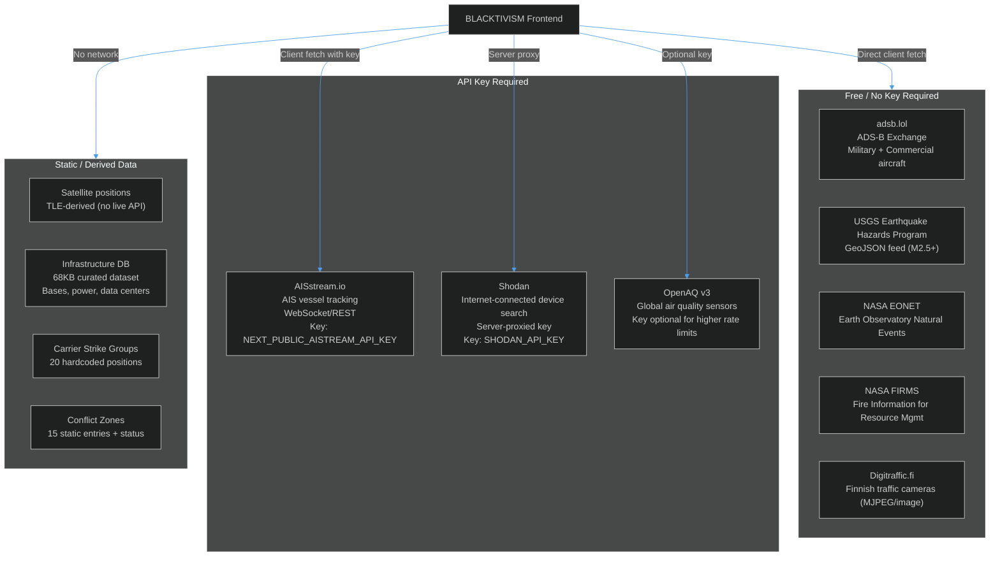
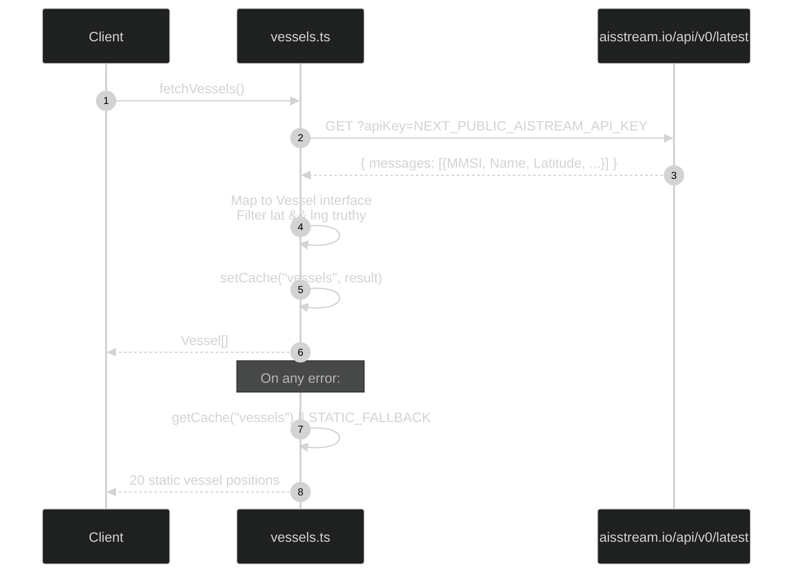
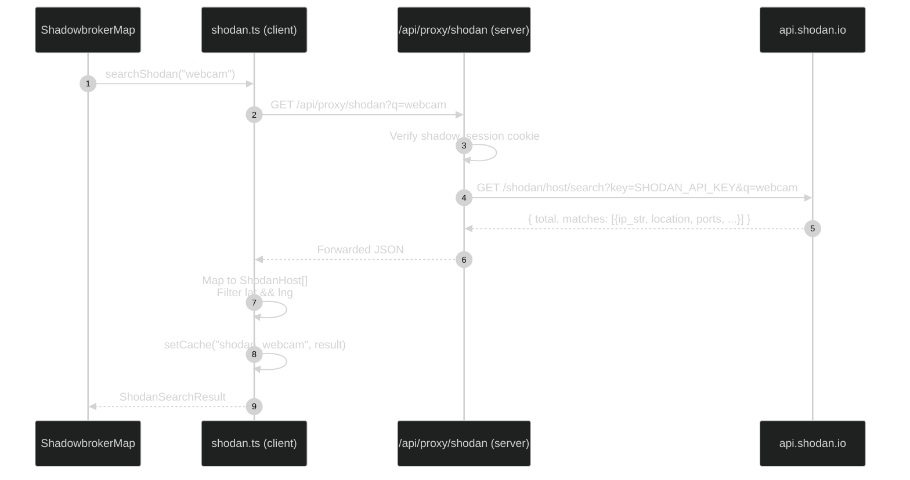
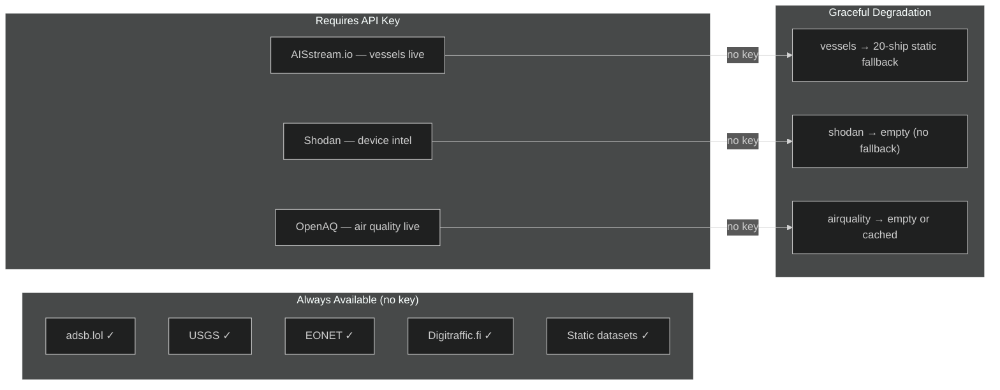

# Integrations

A complete catalog of every external data source, API contract, authentication method, and fallback strategy used by BLACKTIVISM.

---

## Integration Map



---

## adsb.lol — ADS-B Aircraft Tracking

**Military aircraft** ([`src/lib/data/aircraft.ts:18`](https://github.com/AReid987/shadowbroker-deployment/blob/main/src/lib/data/aircraft.ts#L18)):

```
GET https://api.adsb.lol/v2/mil
→ { ac: [{ hex, lat, lon, alt_baro, gs, track, flight, t, category }] }
```

**Commercial flights** ([`src/lib/data/commercialFlights.ts:40`](https://github.com/AReid987/shadowbroker-deployment/blob/main/src/lib/data/commercialFlights.ts#L40)):

```
GET https://api.adsb.lol/v2/lat/{center_lat}/lon/{center_lon}/dist/500
→ { ac: [...] }  (500nm radius around center)
```

| Property | Notes |
|----------|-------|
| Auth | None required |
| Rate Limits | Unstated; keep to < 10 req/min |
| Refresh | Per user layer-refresh action |
| Fallback | Empty array (no static aircraft fallback) |
| Retries | 2 retries, 8s timeout |

---

## AISstream.io — Vessel Tracking



Reference: [`src/lib/data/vessels.ts:21`](https://github.com/AReid987/shadowbroker-deployment/blob/main/src/lib/data/vessels.ts#L21)

**Static fallback** includes 20 named vessels (cargo ships, carriers, destroyers, submarines from major navies) at geopolitically notable positions.

---

## Shodan — Internet Device Intelligence

Shodan requires a server-side proxy to prevent exposing the API key in the client bundle ([`src/lib/data/shodan.ts:34`](https://github.com/AReid987/shadowbroker-deployment/blob/main/src/lib/data/shodan.ts#L34)):



Shodan query presets ([`shodan.ts:25`](https://github.com/AReid987/shadowbroker-deployment/blob/main/src/lib/data/shodan.ts#L25)):
```ts
const SHODAN_QUERIES = [
  'webcam', 'ipcam', 'dvr', 'router', 
  'printer', 'industrial control system'
]
```

Port-based color coding for map markers:
- Ports 554/80/8080 → orange (video/camera)
- Ports 21/23 → yellow (FTP/Telnet)
- Ports 502/44818 → red (Modbus/EtherNet/IP — industrial control)

---

## USGS Earthquake API

```
GET https://earthquake.usgs.gov/earthquakes/feed/v1.0/summary/2.5_week.geojson
→ GeoJSON FeatureCollection
  features[].properties: { mag, place, time, url, detail }
  features[].geometry.coordinates: [lng, lat, depth]
```

No API key, no rate limits (USGS public data). [`earthquakes.ts`](https://github.com/AReid987/shadowbroker-deployment/blob/main/src/lib/data/earthquakes.ts) fetches M2.5+ events from the past 7 days.

---

## Digitraffic.fi — CCTV Camera Feeds

Finnish road authority traffic cameras. All publicly accessible MJPEG/JPEG streams ([`cctv.ts:14`](https://github.com/AReid987/shadowbroker-deployment/blob/main/src/lib/data/cctv.ts#L14)):

```
Image URL pattern: https://weathercam.digitraffic.fi/C{6-digit-code}.jpg
Refresh interval:  10 seconds
Type:             'image' (static JPEG, auto-refreshed by CctvViewer)
```

The CCTV pipeline ([`cctvPipeline.ts`](https://github.com/AReid987/shadowbroker-deployment/blob/main/src/lib/data/cctvPipeline.ts)) aggregates additional camera sources and performs health checks.

---

## OpenAQ — Air Quality Data

```
GET https://api.openaq.org/v3/locations?...
→ { results: [{ coordinates, measurements: [{parameter, value, unit}] }] }
```

OpenAQ v3 supports optional API key for higher rate limits. Without key, ~60 req/hour is the free tier.

---

## NASA EONET — Earth Events

```
GET https://eonetapi.nasa.gov/v3/events?limit=100&status=open
→ { events: [{ id, title, categories, geometry: [{coordinates, date}] }] }
```

Covers: wildfires, volcanic activity, severe storms, sea and lake ice, dust and haze.

---

## Integration Health Status



<!-- Sources: src/lib/data/aircraft.ts:18, src/lib/data/vessels.ts:21, src/lib/data/shodan.ts:34, src/lib/data/cctv.ts:14, src/lib/data/commercialFlights.ts:40 -->
